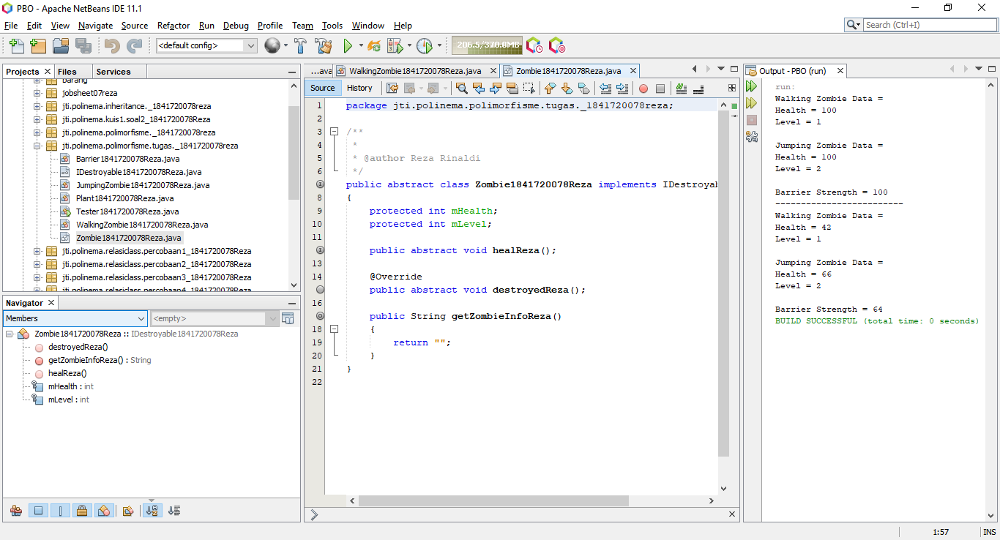
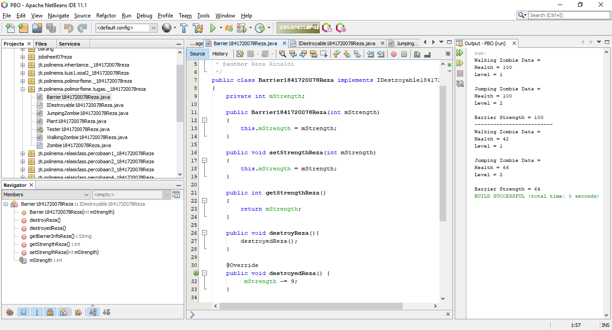
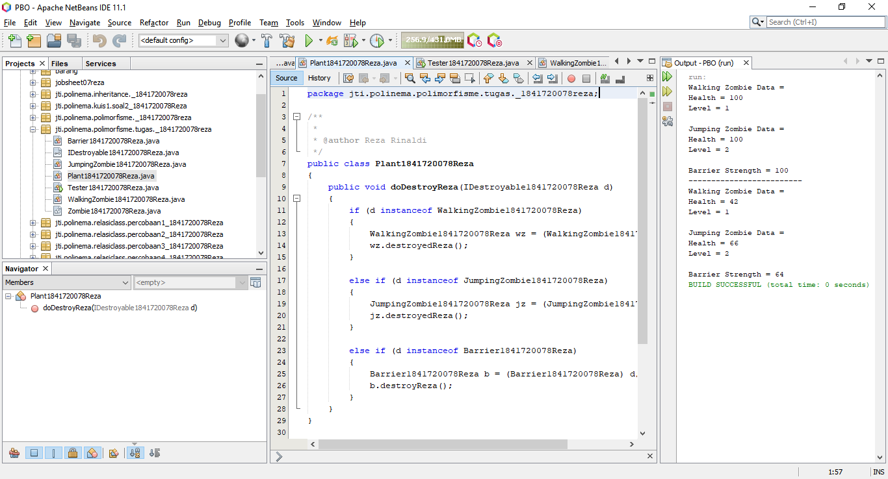
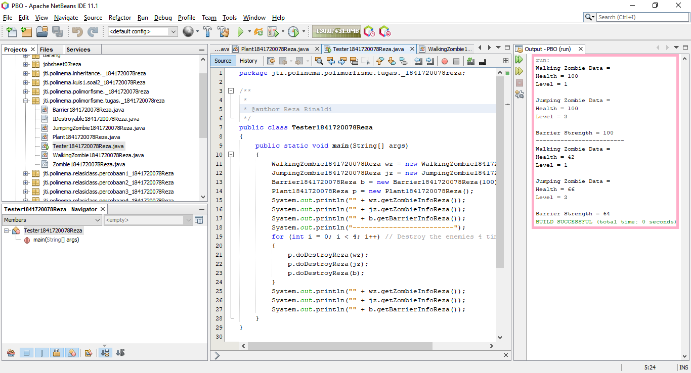

# Laporan Praktikum #10 - Polimorfisme

## Kompetensi

1. Memahami konsep dan bentuk dasar polimorfism
2. Memahami konsep virtual method invication
3. Menerapkan polimorfisme pada pembuatan heterogeneous collection
4. Menerapkan polimorfisme pada parameter/argument method
5. Menerapkan object casting untuk meng-ubah bentuk objek

## Ringkasan Materi

***Polimorfisme***

> Artinya adalah “dapat memiliki berbagai bentuk”

> Polymorphism (polimorfisme) dalam PBO adalah kemampuan untuk mempunyai beberapa bentuk class yang berbeda.

> Pada dasarnya, semua class di Java adalah bersifat polimorfik, karena selain bertipe class itu sendiri, dia juga bertipe class Object.
◦ Karena semua class yang ada di Java, termasuk yang kita buat sendiri, adalah turunan dari class Object Sebagai analogi, terdapat class Binatang dan class Kucing, dimana Kucing adalah subclass dari Binatang. Maka bisa kita katakan, semua kucing adalah binatang.

***Jenis-jenis Polimorfisme***

> Terdapat dua jenis polimorfisme:

>* Static Polymorphism, yakni ketika ada method overloading.

> Static Polymorphism pada Java terjadi jika ada method overloading. **Method overloading: beberapa method dengan nama yang sama tapi beda signature dalam satu class.** Pada saat meng-compile program (compile-time), Java tahu method mana yang dipanggil dengan cara mencocokkan signature dari method yang dipanggil. Oleh karena itu **static polymorphism disebut juga compile time polymorphism atau static binding.**

>* Dynamic Polymorphism, yakni ketika ada method overriding.

> Dynamic Polymorphism terjadi saat ada pembuatan object bertipe parent-class tapi memanggil konstruktor sub-class, dan ada overriding method yang dipanggil.

**Polymorphic Arguments**, yakni parameter method yang menerima suatu nilai yang bertipe sub class.

Pernyataan **instanceof**, sangat berguna untuk mengetahui tipe asal dari suatu polymorphic arguments.

## Percobaan
## Percobaan 1 - Bentuk dasar polimorfisme

Untuk percobaan pada joobsheet ini akan digunakan class diagram di bawah ini:

> 

Dalam suatu perusahaan, pemilik pada tiap bulannya harus membayar gaji pegawai tetap dan rekening listrik. Selain pegawai tetap perusahaan juga memiliki pegawai magang, dimana pegawai ini tidak mendapatkan gaji.

Hasilnya adalah sebagai berikut:

> Employee
> 

> IPayable
> 

> InternshipEmployee
> 

> PermanentEmployee
> 

> ElectricityBill
> 

> Tester1
> 

Link kode program:

[Employee1841720078Reza](../../src/10_Polimorfisme/Employee1841720078Reza.java)

[IPayable1841720078Reza](../../src/10_Polimorfisme/IPayable1841720078Reza.java)

[InternshipEmployee1841720078Reza](../../src/10_Polimorfisme/InternshipEmployee1841720078Reza.java)

[PermanentEmployee1841720078Reza](../../src/10_Polimorfisme/PermanentEmployee1841720078Reza.java)

[ElectricityBill1841720078Reza](../../src/10_Polimorfisme/ElectricityBill1841720078Reza.java)

[Tester1_1841720078Reza](../../src/10_Polimorfisme/Tester1_1841720078Reza.java)

### Pertanyaan - Percobaan 1

1. Class apa sajakah yang merupakan turunan dari class Employee?

**Jawab:**

Class **InternshipEmployee dan PermanentEmployee**.

2. Class apa sajakah yang implements ke interface Payable?

**Jawab:**

Class **PermanentEmployee dan class ElectricityBill**.

3. Perhatikan class Tester1, baris ke-10 dan 11. Mengapa e, bisa diisi dengan objek pEmp (merupakan objek dari class PermanentEmployee) dan objek iEmp (merupakan objek dari class InternshipEmploye) ?

**Jawab:**

Karena keduanya memiliki superclass yang sama sehingga bisa mengisi e yang merupakan instansiasi dari class Employee, dan Employee adalah superclass dari PermanentEmployee dan InternshipEmployee.

4. Perhatikan class Tester1, baris ke-12 dan 13. Mengapa p, bisa diisi dengan objek pEmp (merupakan objek dari class PermanentEmployee) dan objek eBill (merupakan objek dari class ElectricityBill) ?

**Jawab:**

Karena kedua objek tersebut sama" meng-implements interface Payable yang merupakan interface dari objek p.

5. Coba tambahkan sintaks:
```java
p = iEmp;
e = eBill;
```
pada baris 14 dan 15 (baris terakhir dalam method main)! Apa yang menyebabkan error?

**Jawab:**

Akan terjadi Error.

Karena objek p tidak meng-extends class Employee yang merupakan superclass dari InternshipEmployee dan objek e tidak mengimplements interface Payable.

6. Ambil kesimpulan tentang konsep/bentuk dasar polimorfisme!

**Jawab:**

Objek dapat dimasukkan ke dalam array heterogen dan dicasting jika sama superclass-nya.

## Percobaan 2 – Virtual method invocation

* Pada percobaan ini masih akan digunakan class-class dan interface 
yang digunakan pada percobaan sebelumnya.
* Buat class baru dengan nama Tester2. Lalu jalankan class Tester2, dan akan didapatkan hasil sebagai berikut:

> 

Link kode program:

[Tester2_1841720078Reza](../../src/10_Polimorfisme/Tester2_1841720078Reza.java)

### Pertanyaan - Percobaan 2

1. Perhatikan class Tester2 di atas, mengapa pemanggilan e.getEmployeeInfo() pada baris 8 dan 
pEmp.getEmployeeInfo() pada baris 10 menghasilkan hasil sama?

**Jawab:**

Karena terjadi perubahan tipe data atau bisa disebut casting objek. Yang dimana tipe data objek e sebelumnya adalah Employee berubah menjadi tipe data PermanentEmployee, sehingga terjadi overriding method, yang artinya pada saat compile time, method yang terindentifikasi saat compiling adalah method pada class Employee, sedangkan pada saat dijalankan adalah method pada class PermanentEmployee.

2. Mengapa pemanggilan method e.getEmployeeInfo() disebut sebagai pemanggilan method virtual (virtual method invication), sedangkan pEmp.getEmployeeInfo() tidak?

**Jawab:**

Karena adanya perubahan tipe data pada objek e tadi pada perintah e = pEmp. Yang awalnya objek e bertipe data Employee menjadi tipe data PermanentEmployee atau bisa disebut casting.

3. Jadi apakah yang dimaksud dari virtual method invocation? Mengapa disebut virtual?

**Jawab:**

Virtual method invocation terjadi ketika ada pemanggilan overriding method dari suatu objek polimorfisme.

Disebut virtual karena, antara method yang dikenali oleh compiler dan method yang dijalankan oleh JVM (Java Virtual Machine) berbeda.

## Percobaan 3 – Heterogenous Collection

* Pada percobaan ke-3 ini, masih akan digunakan class-class dan interface pada percobaan sebelumnya.
* Buat class baru Tester3.

Hasilnya sebagai berikut:

> 

Link kode program:

[Tester3_1841720078Reza](../../src/10_Polimorfisme/Tester3_1841720078Reza.java)

### Pertanyaan - Percobaan 3

1. Perhatikan array e pada baris ke-8, mengapa ia bisa diisi dengan objek-objek dengan tipe yang berbeda, yaitu objek pEmp (objek dari PermanentEmployee) dan objek iEmp (objek dari InternshipEmployee) ?

**Jawab:**

Objek e bisa diisi dengan objek bertipe data beda, karena ke-2 objek tersebut (pEmp dan iEmp) memiliki superclass yang sama dengan tipe data objek e (Employee).

2. Perhatikan juga baris ke-9, mengapa array p juga biisi dengan objekobjek dengan tipe yang berbeda, yaitu objek pEmp (objek dari PermanentEmployee) dan objek eBill (objek dari ElectricityBilling) ?

**Jawab:**

Objek p juga bisa, karena kedua objek memiliki superclass yang sama (Payable)

3. Perhatikan baris ke-10, mengapa terjadi error?

**Jawab:**

Karena ada objek yang memiliki berbeda superclass dengan objek array yang menampung sehingga terjadi error. Dilihat dari fungsi array sendiri yaitu menampung data yang bertipe data sama.

## Percobaan 4 – Argumen polimorfisme, instanceod dan casting objek

* Percobaan 4 ini juga masih menggunakan class-class dan interface yang digunakan pada percobaan sebelumnya.

* Buat class baru dengan nama Owner. Owner bisa melakukan pembayaran baik kepada pegawai permanen maupun rekening listrik melalui method pay(). Selain itu juga bisa menampilkan info pegawai permanen maupun pegawai magang melalui method showMyEmployee().

> 

Implementasi ke dalam kode program, hasilnya sebagai berkut :

> Owner
> 

> Tester4
> 

Link kode program:

[Owner1841720078Reza](../../src/10_Polimorfisme/Owner1841720078Reza.java)

[Tester4_1841720078Reza](../../src/10_Polimorfisme/Tester4_1841720078Reza.java)

### Pertanyaan - Percobaan 4

1. Perhatikan class Tester4 baris ke-7 dan baris ke-11, mengapa pemanggilan ow.pay(eBill) dan ow.pay(pEmp) bisa dilakukan, padahal jika diperhatikan method pay() yang ada di dalam class Owner memiliki argument/parameter bertipe Payable? Jika diperhatikan lebih detil eBill merupakan objek dari ElectricityBill dan pEmp merupakan objek dari PermanentEmployee?

**Jawab:**

Kedua objek tersebut bisa dipanggil, karena keduanya sama" mengimplements interface Payable.

2. Jadi apakah tujuan membuat argument bertipe Payable pada method pay() yang ada di dalam class Owner?

**Jawab:**

Agar class yang mengimplements Payable isa dipanggil semua tanpa terkecuali.

3. Coba pada baris terakhir method main() yang ada di dalam class Tester4 ditambahkan perintah ow.pay(iEmp);
> 
Mengapa terjadi error?

**Jawab:**

Karena, objek iEmp tidak meng-implements interface Payable sehingga iEmp tidak dapat memanggil method pada interface Payable dan tidak cocok tipe data yang ada pada objek dengan tipe data parameter.

4. Perhatikan class Owner, diperlukan untuk apakah sintaks p instanceof ElectricityBill pada baris ke-6 ?

**Jawab:**

Sintaks p diperlukan untuk pengecekan apakah ada hubungan antara objek p yang merupakan hasil instansiasi dari interface Payable terhadap class ElectricityBill. Jika ElectricityBill merupakan hasil implements dari interface Payable maka akan muncul hasil true, jika tidak maka false.

5. Perhatikan kembali class Owner baris ke-7, untuk apakah casting objek disana (ElectricityBill eb = (ElectricityBill) p) diperlukan ? Mengapa objek p yang bertipe Payable harus di-casting ke dalam objek eb yang bertipe ElectricityBill ?

**Jawab:**

Agar bisa memanggil method pada class ElectricityBill, karena sebelumnya belum ada instansiasi objek eb pada class Owner sehingga harus dilakukan casting terhadap objek p sebagai penampung dari class lain yang mengimlements dirinya (interface Payable).

Jika dilakukan instansiasi terhadap ElectricityBill sendiri maka, harus mengisi data baru karena terdapat konstruktor berparameter pada class ElectrocotyBill.

## Tugas

Dalam suatu permainan, Zombie dan Barrier bisa dihancurkan oleh Plant dan bisa menyembuhkan diri. Terdapat dua jenis Zombie, yaitu Walking Zombie dan Jumping Zombie. Kedua Zombie tersebut memiliki cara penyembuhanyang berbeda, demikian juga cara penghancurannya, yaitu ditentukan oleh aturan berikut ini:
1. Pada WalkingZombie
- Penyembuhan : Penyembuhan ditentukan berdasar level 
zombie yang bersangkutan
    - Jika zombie level 1, maka setiap kali penyembuhan, health akan bertambah 20%
    - Jika zombie level 2, maka setiap kali penyembuhan, health akan bertambah 30%
    - Jika zombie level 3, maka setiap kali penyembuhan, health akan bertambah 40%
- Penghancuran : setiap kali penghancuran, health akan 
berkurang 2%.

2. Pada Jumping Zombie
- Penyembuhan : Penyembuhan ditentukan berdasar level 
zombie yang bersangkutan
    - Jika zombie level 1, maka setiap kali penyembuhan, health akan bertambah 30%
    - Jika zombie level 2, maka setiap kali penyembuhan, health akan bertambah 40%
    - Jika zombie level 3, maka setiap kali penyembuhan, health akan bertambah 50%
- Penghancuran : setiap kali penghancuran, health akan 
berkurang 1%

Buat program dari class diagram di bawah ini!

> 

Hasil outputnya:

> Zombie
> 

> IDestroyable
> 

> WalkingZombie
> 

> JumpingZombie
> 

> Barrier
> 

> Plant
> 

> Tester
> 

Link kode program : 

[Zombie1841720078Reza](../../src/10_Polimorfisme/Zombie1841720078Reza.java)

[IDestroyable1841720078Reza](../../src/10_Polimorfisme/IDestroyable1841720078Reza.java)

[WalkingZombie1841720078Reza](../../src/10_Polimorfisme/WalkingZombie1841720078Reza.java)

[JumpingZombie1841720078Reza](../../src/10_Polimorfisme/JumpingZombie1841720078Reza.java)

[Barrier1841720078Reza](../../src/10_Polimorfisme/Barrier1841720078Reza.java)

[Plant1841720078Reza](../../src/10_Polimorfisme/Plant1841720078Reza.java)

[Tester1841720078Reza](../../src/10_Polimorfisme/Tester1841720078Reza.java)

## Kesimpulan

Pada jobsheet ke-10 ini kita diperkenalkan :

***Polimorfisme***

Polimorfisme, bisa dilakukan asalkan subclass sudah meng-extends superclass (class biasa maupun abstract class) maupun implements satu atau lebih interface. Sebuha objek subclass bisa berubah tipe data menjadi superclass dengan cara upcasting dan sebaliknya objek dari superclass juga bisa downcast menjadi bertipe data subclass. Ketik terjadi casting dan memanggil method pada objek tersebut maka method yang tampil adalah method pada class setelah casting.

## Pernyataan Diri

Saya menyatakan isi tugas, kode program, dan laporan praktikum ini dibuat oleh saya sendiri. Saya tidak melakukan plagiasi, kecurangan, menyalin/menggandakan milik orang lain.

Jika saya melakukan plagiasi, kecurangan, atau melanggar hak kekayaan intelektual, saya siap untuk mendapat sanksi atau hukuman sesuai peraturan perundang-undangan yang berlaku.

Ttd,

***(Reza Rinaldi)***
