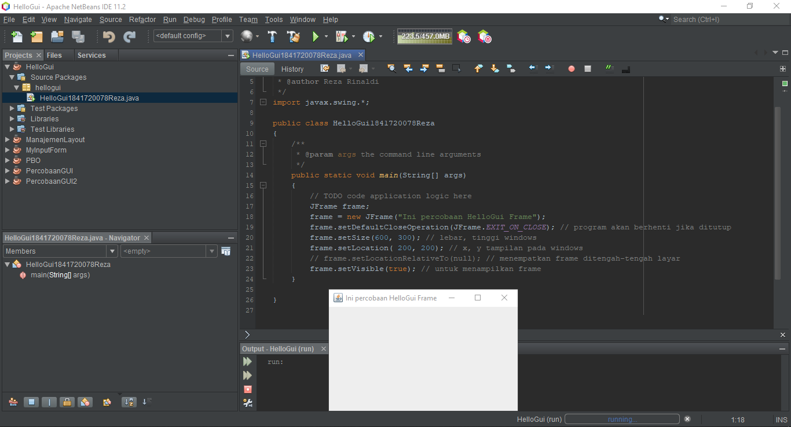
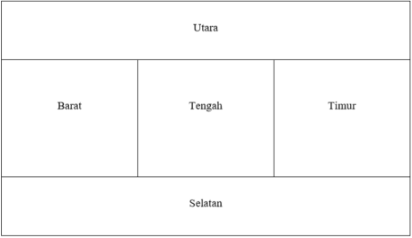
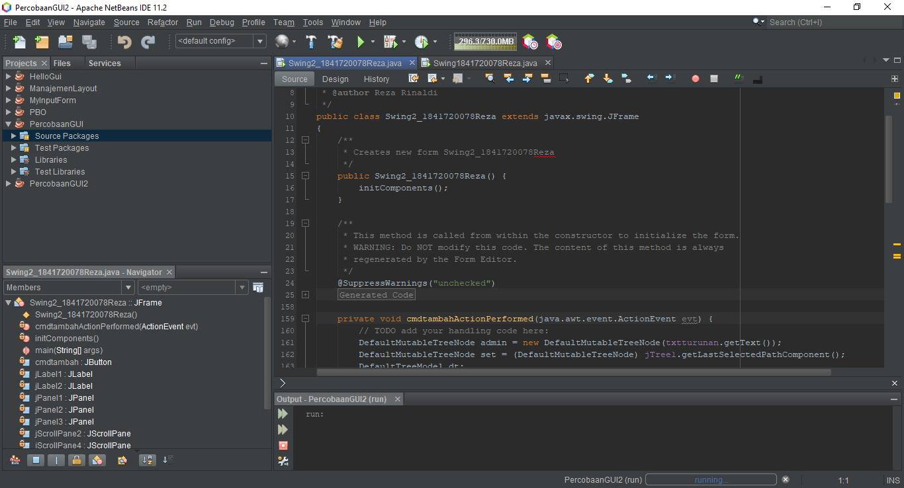

# Laporan Praktikum #11 - GUI

## Kompetensi

1. Membuat aplikasi Graphical User Interface sederhana dengan bahasa pemrograman java;
2. Mengenal komponen GUI seperti frame, label, textfield, combobox, radiobutton, checkbox, 
textarea, menu, serta table;
3. dan Menambahkan event handling pada aplikasi GUI.

## Ringkasan Materi

***GUI (Graphical User Interface)*** 

Pada bab-bab sebelumnya interaksi antara user dengan program hanya berbasis console editor dengan tampilan dos yang membosankan, maka agar interaksi antara user dengan program tidak membosankan diperlukanlah sebuah interface yang menghubungkan antara user dengan program dengan tampilan grafis, interface ini dinamakan dengan GUI (*Graphical User Interface*). Dalam pemrograman GUI terdapat beberapa bagian yang harus dilakukan yaitu:

1. Membuat windows utama.
2. Menentukan komponen-komponen pendukung program.
3. Menentukan tata letak layout agar nantinya semua komponen – komponen yang sudah dipersiapkan bisa diaatur sedemikian rupa.
4. Event Handling dari sebuah aktivitas, seperti penekanan button, check box dan lain-lain.

**Java Swing** merupakan bagian dari JFC (*Java Foundation Classes*) yang menyediakan API untuk menangani hal yang berkaitan dengan GUI bagi program Java. Kita bisa membedakan komponen Swing dengan komponen AWT, di mana pada umumnya kelas-kelas yang berada dalam ***komponen Swing diawali dengan huruf J***, misal: **JButton, JLabel, JTextField, JRadioButton**.

## Percobaan
## Percobaan 1 - JFrame HelloGUI

Untuk membuat aplikasi Java berbasis GUI, kita butuh sebuah frame atau applet untuk media eksekusi aplikasi GUI. Pada Java sebuah frame dapat diwakili oleh sebuah kelas, yaitu JFrame. Melalui kelas JFrame kita bisa mendesain tampilan Java GUI sesuai kebutuhan. Beberapa method yang penting dan sering dipakai yaitu:

- setSize() : menentukan ukuran frame 
- setLocation() : menentukan lokasi frame pada bagian pojok kiri atas 
- setVisible() : menampilkan frame 
- setDefaultCloseOperation() : menentukan - operasi ketika frame ditutup 
- setLocationRelativeTo() : menentukan lokasi frame relatif terhadap parameter 
komponen yang diinputkan 
- Pack() : menentukan secara otomatis ukuran frame sesuai komponen yang 
dimasukkan

Implementasi ke dalam kode program, hasilnya adalah sebagai berikut:

> 

Link kode program:

[HelloGui1841720078Reza](../../src/11_GUI/HelloGui1841720078Reza.java)

## Percobaan 2 - Menangani Input Pada GUI

Selanjutnya adalah bagaimana memanfaatkan komponen-komponen GUI pada Java untuk menangani inputan, dengan memanfaatkan JFrame, JButton, JLabel, JTextField, JPanel dsb.

Implementasi ke dalam kode program, hasilnya adalah sebagai berikut:

> 

### Pertanyaan - Percobaan 2

1. Modifikasi kode program dengan menambahkan JButton baru untuk melakukan fungsi perhitungan penambahan, sehingga ketika button di klik (event click) maka akan menampilkan hasil penambahan dari nilai A dan B.

**Jawab:**

Setelah dimodifikasi, hasilnya adalah sebagai berikut :

> 

Selengkapnya lihat kode program dibawah:

Link kode program:

[MyInputForm1841720078Reza](../../src/11_GUI/MyInputForm1841720078Reza.java)

## Percobaan 3 - Manajemen Layout

Java GUI menyediakan beberapa layout yang dapat digunakan pada program. Pada modul praktikum ini akan dijelaskan 3 contoh GUI layout, yaitu:

- Border layout 
- Grid layout 
- Box layout

Sebuah layout border dapat diilustrasikan pada Gambar dibawah, di mana kita dapat meletakkan komponen GUI pada lokasi tertentu misal utara, barat, tengah, timur, dan selatan. Untuk menentukan jenis layout yang akan digunakan, kita dapat memanggil method setLayout() dan selanjutnya memasukkan objek Border Layout.

> 

Implementasi ke dalam kode program, hasilnya adalah sebagai berikut:

> Border
> 

> Box
> 

> Grid
> 

> LayoutGUI
> 

Link kode program:

[Border1841720078Reza](../../src/11_GUI/Border1841720078Reza.java)

[Box1841720078Reza](../../src/11_GUI/Box1841720078Reza.java)

[Grid1841720078Reza](../../src/11_GUI/Grid1841720078Reza.java)

[LayoutGUI1841720078Reza](../../src/11_GUI/LayoutGUI1841720078Reza.java)

### Pertanyaan - Percobaan 3

1. Apa perbedaan dari Grid Layout, Box Layout dan Border Layout?

**Jawab:**

- Grid Layout yakni, menempatkan komponen dalam bentuk “rectangular grid”. Pada percobaan diatas akan membuat layout grid dengan memiliki ukuran 4x2 dan pada masing-masing grid akan diisi dengan tombol. GridLayout menempatkan komponen dengan urutan dari kiri ke kanan dan dari atas ke bawah. GridLayout akan memaksa setiap komponen untuk menempati space container yang kosong serta membagi rata ukuran space tersebut.

- Box Layout yakni, menempatkan komponen dalam satu baris atau satu kolom. Membuat tampilan layout dengan bentuk Box Layout dan orientasi Y, swing menyediakan sebuah kelas yang bernama Box yaitu sebuah container yang secara otomatis memiliki Box Layout manager.

- Border Layout yakni, di mana kita dapat meletakkan komponen GUI pada lokasi tertentu misal utara, barat, tengah, timur, dan selatan.

2. Apakah fungsi dari masing-masing kode berikut?
```java
JFrame frame = new Border();
frame.setDefaultCloseOperation(JFrame.EXIT_ON_CLOSE);
frame.setVisible(true);

JFrame frame2 = new Grid();
frame2.setDefaultCloseOperation(JFrame.EXIT_ON_CLOSE);
frame2.setVisible(true);

JFrame frame3 = new Box();
frame3.setDefaultCloseOperation(JFrame.EXIT_ON_CLOSE);
frame3.setVisible(true);
```

**Jawab:**

* setDefaultCloseOperation yakni, untuk mengatur / memilih cara pehentian program.
* JFrame.EXIT_ON_CLOSE yakni, untuk menghentikan program jika menekan tombol close.
* setVisible yakni, untuk menampilkan frame-nya.

## Percobaan 4 -  Membuat GUI Melalui IDE Netbeans

Kali ini kita akan memulai membuat GUI pada aplikasi Apache Netbeans. Membuat project PercobaanGUI terlebih dahulu, lalu membuat file JFrame Form, lalu membuat file class dengan nama Swing.

Implementasi ke dalam kode program, hasilnya adalah sebagai berikut:

> Source
> 

> Design
> 

> Hasil
> 
> 

### Pertanyaan - Percobaan 4

1. Apakah fungsi dari kode berikut?
```java
java.awt.EventQueue.invokeLater(new Runnable() {
    public void run() {
        new Swing().setVisible(true);
    }
});
```

**Jawab:**

Berguna untuk membuat, menjalankan dan menampilkan form yang sudah dibuat.

2. Mengapa pada bagian logika checkbox dan radio button digunakan multiple if ?

**Jawab:**

Karena, setiap checkbox atau radio button memiliki isi yang berbeda-beda (jika mempunyai checkbox / radio button lebih dari 1) dan agar saat memilih tidak bertabrakan (hasilnya).

3. Lakukan modifikasi pada program untuk melakukan menambahkan inputan berupa alamat dan berikan fungsi pemeriksaan pada nilai Alamat tersebut jika belum diisi dengan menampilkan pesan peringatan.

**Jawab:**

Setelah dimodifikasi, hasilnya adalah sebagai berikut :

> Source
> 

> Design
> 

> Hasil
> 
> 

> Jika alamat belum diisi
> 

> Maka akan muncul pesan
> 

Link kode program:

[Swing1841720078Reza (java)](../../src/11_GUI/Swing1841720078Reza.java)

[Swing1841720078Reza (form)](../../src/11_GUI/Swing1841720078Reza.form)

## Percobaan 5 - JTabPane, JTtree, JTable

Langkahnya hampir sama seperti percobaan sebelumnya (Percobaan 4). Kali ini kita akan membuat project baru dengan nama PercobaanGUI2, lalu membuat file class dengan nama Swing2.

Implementasi ke dalam kode program, hasilnya adalah sebagai berikut:

> Source (Halaman 3)
> 

> Design (Halaman 3)
> 

> Hasil (Halaman 3)
> 

### Pertanyaan - Percobaan 5

1. Apa kegunaan komponen swing JTabPane, JTtree, pada percobaan 5?

**Jawab:**

* JTabPane yakni, untuk membuat panel berbentuk tab atau halaman
* JTree yakni, untuk menampilkan data dengan hirarki properti dengan menambahkan node ke node dan menyimpan konsep induk dan anak node

2. Modifikasi program untuk menambahkan komponen JTable pada tab Halaman 1 dan tab Halaman 2

**Jawab:**

Setelah dimodifikasi, hasilnya adalah sebagai berikut :

> Source (Halaman 1)
> 

> Design (Halaman 1)
> 

> Hasil (Halaman 1)
> 

> Source (Halaman 2)
> 

> Design (Halaman 2)
> 

> Hasil (Halaman 2)
> 

Link kode program:

[Swing2_1841720078Reza (java)](../../src/11_GUI/Swing2_1841720078Reza.java)

[Swing2_1841720078Reza (form)](../../src/11_GUI/Swing2_1841720078Reza.form)

## Tugas

Buatlah Sebuah Program yang mempunyai fungsi seperti kalkulator (mampu menjumlahkan, 
mengurangkan, mengalikan dan membagikan. Dengan tampilan seperti berikut:

> 

Implementasi ke dalam kode program, hasilnya adalah sebagai berikut:

> Source
> 

> Design
> 

> Hasil

> 

> Contoh diatas adalah hasil perkalian 20 * 12, maka hasilnya 240

>NB : Tipe data yang saya gunakan adalah float, maka hasil dari operasi ada "," dibelakangnya. 

Link kode program : 

[Kalkulator1841720078Reza (java)](../../src/11_GUI/Kalkulator1841720078Reza.java)

[Kalkulator1841720078Reza (form)](../../src/11_GUI/Kalkulator1841720078Reza.form)

## Kesimpulan

> Pada jobsheet ke-11 kita dapat mengetahui,

>* Apa itu JFrame | Form.
>* Menangani input pada GUI.
>* Bagaimana manajemen Border Layout, Grid Layout, dan Box Layout.
>* Bagaimana cara membuat GUI melalui IDE Netbeans.
>* Pembuatan JTabPane, JTtree, JTable.
>* Cara membuat kalkulator sederhana dengan GUI.

## Pernyataan Diri

Saya menyatakan isi tugas, kode program, dan laporan praktikum ini dibuat oleh saya sendiri. Saya tidak melakukan plagiasi, kecurangan, menyalin/menggandakan milik orang lain.

Jika saya melakukan plagiasi, kecurangan, atau melanggar hak kekayaan intelektual, saya siap untuk mendapat sanksi atau hukuman sesuai peraturan perundang-undangan yang berlaku.

Ttd,

***(Reza Rinaldi)***
