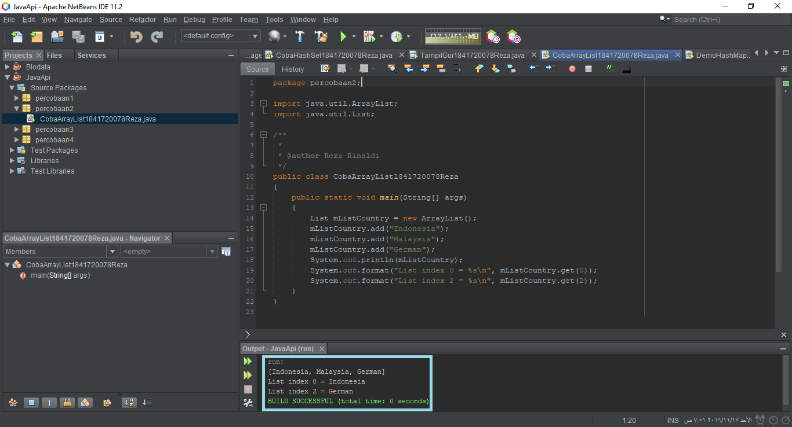
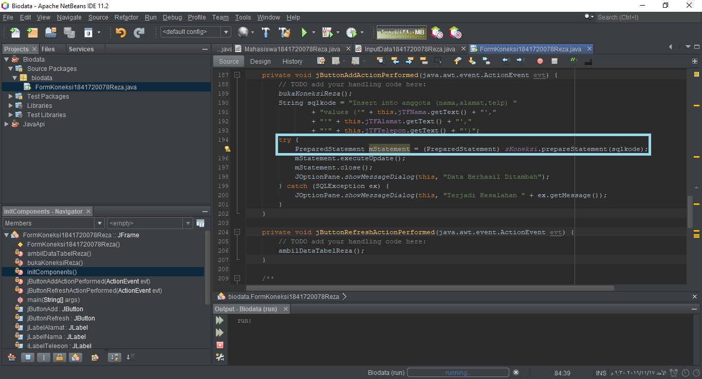
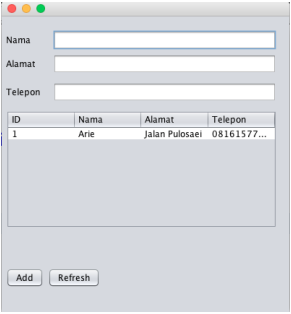

# Laporan Praktikum #12 - Collection (List, Set, Map) dan Database

## Kompetensi

- Memahami cara penyimpanan objek menggunakan Collection dan Map.
- Mengetahui pengelompokan dari Collection.
- Mengetahui perbedaan dari interface Set, List dan Map.
- Mengetahui penggunaan class-class dari interface Set, List, dan Map.
- Memahami koneksi database menggunakan JDBC dan JDBC API

## Ringkasan Materi

 **Collection** adalah suatu objek yang bisa digunakan untuk menyimpan sekumpulan objek. Objek yang ada dalam Collection disebut elemen. Collection menyimpan elemen yang bertipe Object, sehingga berbagai tipe object bisa disimpan dalam Collection. Class-class mengenai Collection tergabung dalam Java Collection Framework. Class-class Collection diletakkan dalam package java.util dan mempunyai dua interface utama yaitu **Collection**.

Collection terbagi menjadi 3 kelompok yaitu:
- **Set**

**Set** mengikuti model himpunan, dimana objek/anggota yang tersimpan dalam Set harus unik. Urutan maupun letak dari anggota tidak penting, hanya keberadaan anggota saja yang penting. Kelas konkrit yang mengimplementasikan Set harus memastikan bahwa tidak terdapat elemen duplikat yang dapat ditambahkan ke dalam set. Yaitu, tidak terdapat dua elemen e1 dan e2 yang berada di dalam set yang membuat e1.equals(e2) bernilai true. Class- Class yang mengimplementasikan interface Set adalah HashSet. Pembuatan objek HashSet 
adalah sebagai berikut:
```java
Set <nama_objek_HashSet> = new HashSet();
```

- **List**

**List** digunakan untuk menyimpan sekumpulan objek berdasarkan urutan masuk (ordered) dan menerima duplikat. Cara penyimpanannya seperti array, oleh sebab itu memiliki posisi awal dan posisi akhir, menyisipkan objek pada posisi tertentu, mengakses dan menghapus isi list, dimana semua proses ini selalu didasarkan pada urutannya. Class-class yang mengimplementasikan interface List adalah Vector, Stack, Linked List dan Array List. Pada jobsheet ini yang akan dibahas adalah ArrayList. Pembuatan objek ArrayList adalah sebagai berikut:
```java
ArrayList <nama_objek_arraylist>=new ArrayList();
```

- **Map**

Perbedaaan mendasar **map** dengan collection yang lain, untuk menyimpan objek pada Map, perlu sepasang objek, yaitu key yang bersifat unik dan nilai yang disimpan. Untuk mengakses nilai tersebut maka kita perlu mengetahui key dari nilai tersebut. Map juga dikenal sebagai dictionary/kamus. Pada saat menggunakan kamus, perlu suatu kata yang digunakan untuk pencarian. Class-class yang mengimplementasikan Map adalah Hashtable,HashMap, LinkedHashMap. Pada jobsheet ini yang akan dibahas adalah HashMap. Pembuatan objek HashMap adalah sebagai berikut:
```java
HashMap <nama_objek_HashMap> = new HashMap();
```

- ***JDBC API***

***JDBC API*** merupakan Java Database Connectivity Application Programming Interface (JDBC API). Pada dasarnya JDBC API terdiri dari satu set kelas dan interface yang digunakan untuk berinteraksi dengan database dari aplikasi Java. Umumnya, JDBC API melakukan 3 (tiga) fungsi berikut:
- Membangun koneksi antara aplikasi Java dan database 
- Membangun dan mengeksekusi query 
- Memproses hasil

## Percobaan
## Percobaan 1 (Set - HashSet)

Percobaan kali ini kita akan menggunakan Collection Set dengan interface HashSet.

Implementasi ke dalam kode program, hasilnya adalah sebagai berikut:

> 

Link kode program :

[CobaHashSet1841720078Reza](../../src/12_Java_API/CobaHashSet1841720078Reza.java)

### Pertanyaan - Percobaan 1

1. Apakah fungsi import java.util.*; pada program diatas!

**Jawab:**

Untuk meng-import library util yang berisi berbagai macam class seperti: HashSet, ArrayList, HashMap, dan lain-lain.

2. Pada baris program keberapakah yang berfungsi untuk menciptakan object HashSet?

**Jawab:**

Pada baris ke-15:
> 

3. Apakah fungsi potongan program dibawah ini pada percobaan 1!
```java
mSetCity.add("Malang");
mSetCity.add("Banyuwangi");
mSetCity.add("Jogjakarta");
mSetCity.add("Batu");
```
**Jawab:**

Untuk menambahkan element kedalam HashSet bernama mSetCity.

4. Tambahkan set.add(“Malang”); kemudian jalankan program! Amati hasilnya dan jelaskan mengapa terjadi error!

**Jawab:**

Terjadi error dikarenakan HashSet / Set bernama **set** belum ada, sehingga terjadi error.
> 

5. Jelaskan fungsi potongan program dibawah ini pada percobaan 1!
```java
Iterator<String> mIterator = mSetCity.iterator();

while (mIterator.hasNext()) 
{
    System.out.println(mIterator.next().toLowerCase();
}
```
**Jawab:**

Fungsi dari interface Iterator<String> mIterator = mSetCity.iterator(); adalah untuk memperbolehkan kita traverse, akses data dan menghapus data dari collection (mSetCity).

Kemudian, fungsi dari perulangan while adalah melakukan traverse mSetCity.

## Percobaan 2 (List - ArrayList)

Percobaan kali ini kita akan menggunakan Collection List dengan interface ArrayList.

Implementasi ke dalam kode program, hasilnya adalah sebagai berikut:

> 

Link kode program :

[CobaArrayList1841720078Reza](../../src/12_Java_API/CobaArrayList1841720078Reza.java)

### Pertanyaan - Percobaan 2

1. Apakah fungsi potongan program dibawah ini!
```java
System.out.println(mListCountry);
System.out.format("List index 0 = %s\n", mListCountry.get(0));
System.out.format("List index 2 = %s\n", mListCountry.get(2));
```
**Jawab:**

Untuk mencetak seluruh data dari mListArray dan pada program system.out.format berfungsi untuk print data secara spesifik, pada potongan kode diatas diambil data dari mListArray index 0 dan index 2.

2. Ganti potongan program pada soal no 1 menjadi sebagai berikut
```java
System.out.println("Country List");
Iterator mIterator = mListCountry.iterator();
while (mIterator.hasNext()) 
{
    Object element = mIterator.next();
    System.out.format("%s ", element);
}
```
Kemudian jalankan program tersebut!

**Jawab:**

> 

3. Jelaskan perbedaan menampilkan data pada ArrayList menggunakan potongan program pada 
soal no 1 dan no 2!

**Jawab:**

- Soal no 1 menampilkan data secara spesifik pada index berapa tanpa melakukan traverse,
- sedangkan soal no 2 dilakukan traverse kemudian setiap element di print hingga akhir.

## Percobaan 3 (Map - HashMap)

Percobaan kali ini kita akan menggunakan Collection Map dengan interface HashMap.

Implementasi ke dalam kode program, hasilnya adalah sebagai berikut:

> 

Link kode program :

[DemoHashMap1841720078Reza](../../src/12_Java_API/DemoHashMap1841720078Reza.java)

### Pertanyaan - Percobaan 3

1. Jelaskan fungsi hMapItem.put("1","Biskuit") pada program!

**Jawab:**

Untuk menambahkan element pada HashMap dengan key 1 dan value Biskuit.

2. Jelaskan fungsi hMapItem.size() pada program!

**Jawab:**

Untuk mendapatkan banyaknya data yang ada dalam HashMap.

3. Jelaskan fungsi hMapItem.remove("1") pada program!

**Jawab:**

Untuk menghapus data dengan acuan data yang dihapus adalah data pada key 1.

4. Jelaskan fungsi hMapItem.clear() pada program!

**Jawab:**

Untuk menghapus semua data yang ada dalam HashMap.

5. Tambahkan kode program yang di blok pada program yang sudah anda buat!
```java
public class DemoHashMap1841720078Reza 
{
    public static void main(String[] args) 
    {
        HashMap hMapItem = new HashMap();
        hMapItem.put("1", "Biskuit");
        hMapItem.put("2", "Shampoo");
        hMapItem.put("3", "Soap");
        System.out.println(hMapItem);

        //blok
        Collection mCollection = hMapItem.values();
        Iterator mIterator = mCollection.iterator();
        while (mIterator.hasNext())
        {
            System.out.println(mIterator.next());
        }
        //blok

        System.out.format("HashMap Item Total : %d\n\n", hMapItem.size());
        
        Object mObject = hMapItem.remove("1");
        System.out.format("%s remove from Hashmap\n", mObject);
        System.out.format("HashMap Item Total : %d\n", hMapItem.size());
        System.out.println(hMapItem);
        
        hMapItem.clear();
        System.out.format("HashMap Item Total : %d\n", hMapItem.size());
    }
}
```
**Jawab:**

> 

6. Jalankan program dan amati apa yang terjadi!

**Jawab:**

> 

7. Apakah perbedaan program sebelumnya dan setelah ditambahkan kode program pada soal no 5 diatas? Jelaskan!

**Jawab:**

Values dari hMapItem telah dimasukkan kedalam Collection bernama mCollection sehingga tidak perlu menggunakan key untuk mengakses value kemudian dilakukan traverse pada mCollection hingga akhir.

## Percobaan 4 (Implementasi ArrayList dalam GUI)

Pada percobaan sebelumnya kita telah mencoba menggunakan Collection, percobaan kali ini kita akan implementasi Collection (ArrayList) dalam GUI.

Hasilnya adalah sebagai berikut:

> Mahasiswa
> 

> InputData
> 

> Source - TampilGui
> 

> Design - TampilGui
> 

> Hasil - TampilGui

> 

Link kode program :

[Mahasiswa1841720078Reza](../../src/12_Java_API/Mahasiswa1841720078Reza.java)

[InputData1841720078Reza](../../src/12_Java_API/InputData1841720078Reza.java)

[TampilGui1841720078Reza (java)](../../src/12_Java_API/TampilGui1841720078Reza.java)

[TampilGui1841720078Reza (form)](../../src/12_Java_API/TampilGui1841720078Reza.form)

## Percobaan 5 (Aplikasi Biodata)

Pada percobaan kali ini kita akan mencoba membuat aplikasi biodata dengan menambah data ke database (MySQL) dan dapat tersambung dengan aplikasi ini.

Hasilnya adalah sebagai berikut:

> Source - Koneksi
```sql
CREATE TABLE anggota (id INT NOT NULL AUTO_INCREMENT, nama 
VARCHAR(50) NOT NULL, alamat VARCHAR(100) NOT NULL, telp
VARCHAR(30) NOT NULL, PRIMARY KEY (id));
```

> Database
> 

> Source
> 

> Design
> 

> Hasil

> 

Link kode program :

[FormKoneksi1841720078Reza (java)](../../src/12_Java_API/FormKoneksi1841720078Reza.java)

[FormKoneksi1841720078Reza (form)](../../src/12_Java_API/FormKoneksi1841720078Reza.form)

4. Pada button add klik tambahkan code sebagai berikut:
```java
    String sqlkode = "Insert into anggota (nama, alamat, telp)"
    + "values ('" + this.jTFNama.getText() + "',"
    + "'" + this.jTFAlamat.getText() + "',"
    + "'" + this.jTFTelepon.getText() + "')";
    try 
    {
        PreparedStatement mStatement = koneksi.prepareStatement(sqlkode);
        mStatement.executeUpdate();
        mStatement.close();
        JOptionPane.showMessageDialog(this, "Data Berhasil Ditambah");
    } 
        catch (SQLException ex) 
        {
            JOptionPane.showMessageDialog(this, "Terjadi Kesalahan " + ex.getMessage();
        }
```

5. Setelah menambah code pada action button klik, coba jalankan program dan tambahkan data. Apakah program berhasil menambahkan data? Jika tidak apakah penyebabnya.

**Jawab:**

Tidak berhasil.
> 

Ada source code yang error pada method button 'Add', yakni pada baris ke-195 (dibawah try).

Setelah diperbaiki:

> 

6. Jelaskan maksud source code untuk melakukan insert data diatas?

**Jawab:**

- Membuka koneksi ke database.
- Memperiapkan query INSERT.
- Mempersiapkan statement query.
- Mengeksekusi query yang baru ditambahkan.
- Menutup koneksi ke database.
- Memberikan informasi berupa pop up message data berhasil ditambahkan.
- Jika langkah dari 3 hingga 6 ada yang error maka akan muncul pop up message terjadi kesalahan serta pesan sistem error.

8. Selanjutnya buat method ambil_data_tabel seperti berikut:
```java
private void ambil_data_tabel() 
{
    model.getDataVector().removeAllElements();
    model.fireTableDataChanged();
    try 
    {
        buka_koneksi();
        Statement s = koneksi.createStatement();
        String sql = "Select * from anggota";ResultSet r = s.executeQuery(sql);
        while (r.next()) 
        {
            Object[] o = new Object[4];
            o[0] = r.getString("id");
            o[1] = r.getString("nama");
            o[2] = r.getString("alamat");
            o[3] = r.getString("telp");
            model.addRow(o);
        }
            r.close();
            s.close();
    } 
            catch (SQLException e) 
            {
                JOptionPane.showMessageDialog(this,"Terjadi kesalahan " + e.getMessage());
            }
}
```
Jalankan program maka data yang sudah kita add akan tampil seperti berikut:



**(Gambar. Tabel. 2)**

**Jawab:**


9. Jelaskan alur dari method ambil_data_tabel?

**Jawab:**

- Mengkosongkan semua data dari tabel.
- Membuka koneksi ke database.
- Membuat statement query.
- Mengeksekusi query yang telah disiapkan.
- Mendapatkan seluruh data dari hasil query dan dimasukkan kedalam baris tabel.
- Menutup koneksi ke database.
- Jika langkah dari 2 hingga 6 ada yang error maka akan muncul pop up message terjadi kesalahan serta pesan sistem error.

10. Buat fungsi untuk merefresh sehingga data yang baru dapat ditampilkan pada tabel. 2.

**Jawab:**

Pada method button refresh, hanya memanggil method **ambilDataTabel** yang telah kita buat.


## Kesimpulan

 Dalam pratikum ke-12 ini kita dapat mengetahui :
- Cara penyimpanan objek menggunakan Collection dan Map.
- Cara pengelompokan dari Collection.
- Perbedaan dari interface Set, List dan Map.
- Penggunaan class-class dari interface Set, List, dan Map.
- Cara menyambungkan database menggunakan JDBC dan JDBC API.

## Pernyataan Diri

Saya menyatakan isi tugas, kode program, dan laporan praktikum ini dibuat oleh saya sendiri. Saya tidak melakukan plagiasi, kecurangan, menyalin/menggandakan milik orang lain.

Jika saya melakukan plagiasi, kecurangan, atau melanggar hak kekayaan intelektual, saya siap untuk mendapat sanksi atau hukuman sesuai peraturan perundang-undangan yang berlaku.

Ttd,

***(Reza Rinaldi)***
