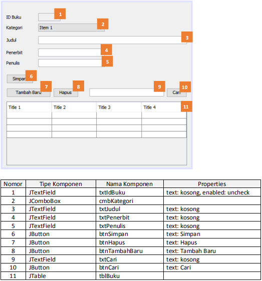

# Laporan Praktikum #14 - GUI dan Database

## Kompetensi

1. Menggunakan paradigma berorientasi objek untuk interaksi dengan database
2. Membuat backend dan frontend
3. Membuat form sebagai frontend

## Ringkasan Materi

Kali ini kita akan menggunakan paradigma berorientasi objek yang telah kita pelajari untuk membuat 
aplikasi berbasis database dan dilengkapi dengan form sebagai Graphical User Interface (GUI).
Secara umum, tahapan yang akan kita lakukan adalah sebagai berikut:
1. Membuat database dan tabel-tabelnya.
2. Membuat backend yang berisi class-class yang mewakili data yang ada pada database, dan 
class helper untuk melakukan eksekusi query database.
3. Membuat frontend yang merupakan antarmuka kepada pengguna. Frontend ini bisa 
berbasis teks (console), GUI, web, mobile, dan sebagainya.

Library yang digunakan untuk project ini antara lain:
1. JDBC, untuk melakukan interaksi ke database.
2. ArrayList, untuk menampung data hasil query ke database.
3. Swing, untuk membuat tampilan GUI.

Untuk percobaan, kita akan membuat sistem informasi Perpustakaan, yang memiliki data antara 
lain: Buku, Kategori, Anggota dan Peminjaman. Fitur yang ada pada aplikasi ini adalah anggota dapat melakukan peminjaman dan pengembalian buku. Berikut adalah class diagram untuk sistem 
informasi ini:


Dapat dilihat dari class diagram diatas, terdapat relasi antar class. Class Buku berelasi dengan 
Kategori dikarenakan terdapat atribut bertipe data Kategori di dalam class buku. Begitu juga class 
Peminjaman yang berelasi dengan class Buku dan Anggota.

## Percobaan
## Percobaan 1

Membuat database.

Langkah pertama untuk percobaan ini adalah membuat database. Install XAMPP, buka 
phpMyAdmin, buat database dbperpus, dan tabel-tabelnya:

Dibawah ini adalah query untuk membuat data table dbperpus:

```sql
CREATE TABLE kategori (idkategori INT(11) NOT NULL AUTO_INCREMENT, nama 
VARCHAR(255) NOT NULL, keterangan VARCHAR(255) NOT NULL, PRIMARY KEY (idkategori));

CREATE TABLE buku(idbuku INT(11) NOT NULL AUTO_INCREMENT, idkategori INT(11) NOT NULL, 
judul VARCHAR(255) NOT NULL, penerbit VARCHAR(255) NOT NULL, 
penulis VARCHAR(255) NOT NULL, PRIMARY KEY (idbuku));

CREATE TABLE anggota (idanggota INT(11) NOT NULL AUTO_INCREMENT, nama 
VARCHAR(255) NOT NULL, alamat VARCHAR(255) NOT NULL, 
telepon VARCHAR(25) NOT NULL, PRIMARY KEY (idanggota));

CREATE TABLE peminjaman (idpeminjaman INT(11) NOT NULL AUTO_INCREMENT, idanggota INT(11) NOT NULL,
idbuku INT(11) NOT NULL, tanggalpinjam DATE NOT NULL, tanggalkembali DATE NOT NULL, PRIMARY KEY (idpeminjaman));
```

> 

Set semua primary key id pada tiap tabel (idanggota, idkategori, idpeminjaman, idbuku) dengan Auto Increment.

## Percobaan 2

Mempersiapkan project.
- Buat project baru, beri nama Perpustakaan.
- Pada project explorer, klik kanan pada Libraries → Add Library, pilih MySQL JDBC Driver.
- Buat package frontend dan backend. Cara membuat package adalah, pada project explorer, klik kanan pada Source Packages → New → Java Package, beri nama package nya (frontend, backend).

> 

## Percobaan 3

Membuat class helper untuk mengeksekusi query SQL. 
- Pada package backend, buat class DBHelper.
- Tambahkan import java.sql.*

Implementasi ke dalam kode program, hasilnya adalah sebagai berikut:

> DBHelper
> 

Link kode program:

[DBHelper1841720078Reza](../../src/14_GUI_dan_Database/DBHelper1841720078Reza.java)

## Percobaan 4

Membuat class Kategori untuk menghandle CRUD pada tabel kategori. 
- Pada package backend, buat class baru yaitu Kategori.
- Tambahkan import java.util.ArrayList dan java.sql.*

Implementasi ke dalam kode program, hasilnya adalah sebagai berikut:

> Kategori
> 

Link kode program:

[Kategori1841720078Reza](../../src/14_GUI_dan_Database/Kategori1841720078Reza.java)

## Percobaan 5

Mencoba backend yang sudah dibuat dengan mengoperasikannya lewat frontend berbasis teks (console). Percobaan ini dapat anda skip jika anda telah yakin bahwa backend yang anda buat sudah berfungsi dengan baik. 
- Pada package frontend, buat class TestBackend.
- Tambahkan import backend.*

Implementasi ke dalam kode program, hasilnya adalah sebagai berikut:

> TestBackend
> 

Link kode program:

[TestBackend1841720078Reza](../../src/14_GUI_dan_Database/TestBackend1841720078Reza.java)

## Percobaan 6.1

Pada percobaan ini kita akan membuat interface GUI untuk class Kategori.
- Pada package frontend, buat JFrame dengan nama FrmKategori. Caranya adalah, klik kanan 
pada package frontend → New →JFrame Form.
- Susun form sehingga seperti berikut ini, atur propertinya sesuai nomor:

> 

Edit kodenya, tambahkan:
- import backend.*,
- java.util.ArrayList,
- javax.swing.table.DefaultTableModel;

Implementasi ke dalam kode program, hasilnya adalah sebagai berikut:

> Source
> 

> Design
> 

> Hasil

> 

Ujicoba:

Tambah Baru, maka textfield (id, nama, keterangan) akan terhapus.

> 

Simpan, kita memilih tulisan pada tabel lalu menggantinya, maka tulisan tersebut akan berubah.

> 

Hapus, salah satu tulisan pada tabel akan terhapus ketika memilih dan menekan Hapus.

> 

Cari, ketik pada textfield sebelah tombol Cari, maka yang kita akan cari akan muncul.

> 

Link kode program:

[FrmKategori1841720078Reza (java)](../../src/14_GUI_dan_Database/FrmKategori1841720078Reza.java)

[FrmKategori1841720078Reza (form)](../../src/14_GUI_dan_Database/FrmKategori1841720078Reza.form)

## Percobaan 6.2

Lakukan hal yang sama untuk data Anggota!
- Buat class Anggota pada package backend, lengkapi atribut dan method-nya.
- Lakukan test pada class TestBackend pada package frontend.

Implementasi ke dalam kode program, hasilnya adalah sebagai berikut:

> Anggota
> 

> TestBackend
> 

Link kode program:

[Anggota1841720078Reza](../../src/14_GUI_dan_Database/Anggota1841720078Reza.java)

[TestBackend1841720078Reza](../../src/14_GUI_dan_Database/TestBackend1841720078Reza.java)

## Percobaan 7.1

Buat form untuk data Anggota. Buat FrmAnggota pada package frontend dan lengkapi komponen, method serta event-nya.

Implementasi ke dalam kode program, hasilnya adalah sebagai berikut:

> Source
> 

> Design
> 

> Hasil

> 

Link kode program:

[FrmAnggota1841720078Reza (java)](../../src/14_GUI_dan_Database/FrmAnggota1841720078Reza.java)

[FrmAnggota1841720078Reza (form)](../../src/14_GUI_dan_Database/FrmAnggota1841720078Reza.form)

## Percobaan 7.2

Untuk data Buku, caranya kurang lebih sama seperti data Kategori dan Anggota. Hanya saja yang berbeda adalah:
- Pemanggilan getKategori().getIdKategori() pada query insert dan update untuk mengeset idkategori pada tabel buku
- Query select yang melibatkan join table pada method getById(), getAll() dan search().

Implementasi ke dalam kode program, hasilnya adalah sebagai berikut:

> Buku
> 

> TestBackend
> 

Link kode program:

[Buku1841720078Reza](../../src/14_GUI_dan_Database/Buku1841720078Reza.java)

[TestBackend1841720078Reza](../../src/14_GUI_dan_Database/TestBackend1841720078Reza.java)

## Percobaan 8

Membuat GUI untuk data Buku, yang dilengkapi dengan combo box untuk memilih kategori yang 
terhubung dengan tabel kategori.
- Pada package frontend, buat jFrame FrmBuku.
- Susun formnya sebagai berikut:

> 

Edit kodenya, tambahkan:
- import backend.*, 
- java.util.ArrayList, 
- javax.swing.table.DefaultTableModel,
- javax.swing.DefaultComboBoxModel;

Implementasi ke dalam kode program, hasilnya adalah sebagai berikut:

> Source
> 

> Design
> 

> Hasil

> 

Ujicoba:

Tambah Baru, maka textfield (id, nama, keterangan) akan terhapus.

> 

Simpan, kita mengisi form, lalu klik simpan maka akan bertambah data pada tabel.

> 

Hapus, salah satu tulisan pada tabel akan terhapus ketika memilih dan menekan Hapus.

> 

Cari, ketik pada textfield sebelah tombol Cari, maka yang kita akan cari akan muncul.

> 

Link kode program:

[FrmBuku1841720078Reza (java)](../../src/14_GUI_dan_Database/FrmBuku1841720078Reza.java)

[FrmBuku1841720078Reza (form)](../../src/14_GUI_dan_Database/FrmBuku1841720078Reza.form)

## Tugas

- Buatlah class Peminjaman.
- Buatlah form FrmPeminjaman dan susun sebagai berikut:

> 

- Atur kode program agar dapat menangani transaksi peminjaman dan pengembalian. **Note**: Pada textbox ID Anggota, pengguna tinggal memasukkan ID anggota, kemudian menekan tombol Cari. Jika ketemu, maka label “Nama Anggota” yang ada di samping tombol Cari tersebut akan menampilkan nama anggota dari ID yang dimasukkan tadi. Begitu juga dengan ID Buku.

Implementasi ke dalam kode program, hasilnya adalah sebagai berikut:

> Peminjaman
> 

> TestBackend
> 

> Menambah data
> 

> Source
> 

> Design
> 

> Hasil 

> 

Ujicoba:

Cari (Nama Anggota), ketikan ID Anggota yang Anda miliki pada idanggota database Anda, maka hasilnya:

> 

Cari (Judul Buku), ketikan ID Buku yang Anda miliki pada idbuku database Anda, maka hasilnya:

> 

Link kode program:

[Peminjaman1841720078Reza](../../src/14_GUI_dan_Database/Peminjaman1841720078Reza.java)

[TestBackend1841720078Reza](../../src/14_GUI_dan_Database/TestBackend1841720078Reza.java)

[FrmPeminjaman1841720078Reza (java)](../../src/14_GUI_dan_Database/FrmPeminjaman1841720078Reza.java)

[FrmPeminjaman1841720078Reza (form)](../../src/14_GUI_dan_Database/FrmPeminjaman1841720078Reza.form)

## Kesimpulan

 Pada jobsheet ke-14 kita dapat mengetahui,
- Menggunakan paradigma berorientasi objek yang telah kita pelajari untuk membuat 
aplikasi berbasis database dan dilengkapi dengan form sebagai Graphical User Interface (GUI). Secara umum, tahapan yang akan kita lakukan adalah sebagai berikut:
1. Membuat database dan tabel-tabelnya.
2. Membuat backend yang berisi class-class yang mewakili data yang ada pada database, dan 
class helper untuk melakukan eksekusi query database.
3. Membuat frontend yang merupakan antarmuka kepada pengguna. Frontend ini bisa 
berbasis teks (console), GUI, web, mobile, dan sebagainya.


## Pernyataan Diri

Saya menyatakan isi tugas, kode program, dan laporan praktikum ini dibuat oleh saya sendiri. Saya tidak melakukan plagiasi, kecurangan, menyalin/menggandakan milik orang lain.

Jika saya melakukan plagiasi, kecurangan, atau melanggar hak kekayaan intelektual, saya siap untuk mendapat sanksi atau hukuman sesuai peraturan perundang-undangan yang berlaku.

Ttd,

***(Reza Rinaldi)***
