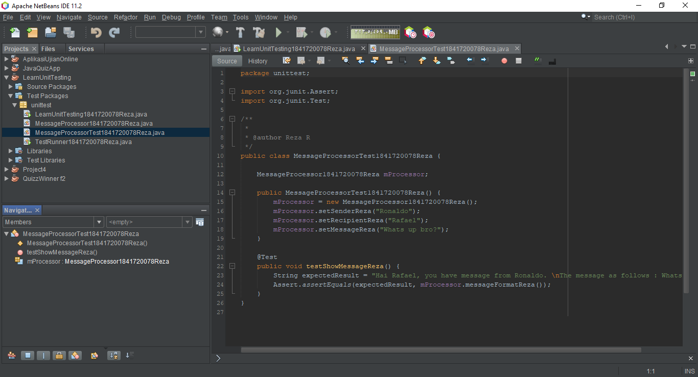

# Laporan Praktikum #15 - Unit Testing

## Kompetensi

1. Memahami konsep dan fungsi unit testing,
2. Menerapkan unit testing dengan JUnit pada program sederhana,
3. Menerapkan unit testing dengan JUnit pada progam yang terkoneksi database;

## Ringkasan Materi

Mengenal **Unit Testing** dengan **JUnit**

Dalam Software Development Life Cycle, testing merupakan fase yang cukup penting. Dari fase ini kita akan mengetahui mutu dari aplikasi yang kita buat. Apakah aplikasi yang kita buat relevan dengan kebutuhan user, apakah aplikasi yang kita buat bebas dari bug, apakah aplikasi kita konsisten outputnya, dsb akan terjawab pada fase testing ini.

Ada 2 jenis method testing yang umum digunakan yaitu Black Box Testing dan White Box Testing.

- Black Box Testing
Menurut Myers (1979) : Proses menjalankan program dengan maksud menemukan kesalahan. Menurut IEEE (1990) : Pengujian yang mengabaikan mekanisme internal sistem atau komponen dan fokus semata-mata pada output yang dihasilkan yang merespon input yang dipilih dan kondisi eksekusi.

- White Box Testing
Metode perancangan test case yang menggunakan struktur kontrol dari perancangan prosedural untuk mendapatkan test case. Digunakan untuk mengetahui cara kerja internal suatu perangkat lunak. Pengujian dilakukan untuk menjamin operasi-operasi internal sesuai dengan spesifikasi yang telah ditetapkan dengan menggunakan struktur kendali dari prosedur yang dirancang.

Pada bahasa pemrograman java, telah dibuat suatu library untuk menangani unit testing. Salah satu yang cukup mainstream yaitu JUnit.

Menggunakan JUnit sebenarnya cukup simple dan mudah. Prinsip utama JUnit adalah buat test class untuk setiap class yang anda buat. Dan uji semua method yang ada pada class tersebut. JUnit juga sudah built in di beberapa IDE seperti Blue J dan Eclipse. Apabila anda menggunakan netbeans, memang anda harus mendownloadnya  jar nya dulu namun setelah itu netbeans bisa me-generate test class sesuai dengan class yang kita buat.

## Percobaan
## Percobaan 1 - Dasar Unit Testing

Pada percobaan yang pertama ini kita akan membuat sebuah program sederhana yang mengilustrasikan sebuah aplikasi pengiriman pesan. Pada program tersebut terdapat satu class utama dimana didalamnya terdapat beberapa method sederhana yang nantinya akan dibuatkan unit test-nya.

Buatlah sebuah project baru di NetBeans dengan nama LearnUnitTesting. Pada package unittest, di tempat yang sama dengan class mainnya, buatlah 1 file class baru bernama MessageProcessor.java.

> 

Implementasi ke dalam kode program, hasilnya adalah sebagai berikut:

> MessageProcessor
> 

> LearnUnitTesting
> 

Sampai disini, aplikasi telah selesai dibuat. Berikutnya akan kita buat pengetesanunit sederhana untuk program kita tersebut. Untuk melakukannya, pertama kali buatlah sebuah package bernama unittesting (sama dengan nama package project), di folder Test Packages. Pada package tersebut, tambahkan 2 buah file class bernama MessageProcessorTest.java dan TestRunner.java.

> 

Implementasi ke dalam kode program, hasilnya adalah sebagai berikut:

> MessageProcessorTest
> 

> TestRunner
> 

>  Hasil unit testing juga dapat dilihat melalui Test Results Window.
> 

Link kode program:

[MessageProcessor1841720078Reza](../../src/15_Unit_Testing/MessageProcessor1841720078Reza.java)

[LearnUnitTesting1841720078Reza](../../src/15_Unit_Testing/LearnUnitTesting1841720078Reza.java)

[MessageProcessorTest1841720078Reza](../../src/15_Unit_Testing/MessageProcessorTest1841720078Reza.java)

[TestRunner1841720078Reza](../../src/15_Unit_Testing/TestRunner1841720078Reza.java)

## Percobaan 2 - Unit Testing dengan Test Case

Pada percobaan kedua kita akan mencoba membuat test case dari salah satu percobaan pada jobsheet minggu ke 14. Struktur file dari percobaan ke satu terdiri dari 4 file class yaitu DBHelper.java, FormKategori.java, Kategori.java dan TestBackend.java.

> 

Hasil akhir dari percobaan satu jobsheet ke 14 adalah seperti pada gambar berikut. Aplikasi dapat melakukan insert, update, select dan delete ke database dbperpus tabel kategori.

> 

Selanjutnya kita akan membuat class KategoriTest pada projek jobhsheet ke-14 ini pada percobaan 1.

Implementasi ke dalam kode program, hasilnya adalah sebagai berikut:

> AnggotaTest
> 

Edit file bernama TestRunner pada percobaan sebelumnya menjadi seperti berikut.

> 

Link kode program:

[Kategori1841720078Reza](../../src/15_Unit_Testing/Kategori1841720078Reza.java)

[Kategori1841720078RezaTest.java](../../src/15_Unit_Testing/Kategori1841720078RezaTest.java)

[TestRunner1841720078Reza](../../src/15_Unit_Testing/TestRunner1841720078Reza.java)

## Tugas

- Buat test case untuk percobaan kedua pada jobsheet ke 14.

Implementasi ke dalam kode program, hasilnya adalah sebagai berikut:

> AnggotaTest
> 

> TestRunner
> 

Link kode program :

[Anggota1841720078Reza](../../src/15_Unit_Testing/Anggota1841720078Reza.java)

[Anggota1841720078RezaTest](../../src/15_Unit_Testing/Anggota1841720078RezaTest.java)

[TestRunner1841720078Reza](../../src/15_Unit_Testing/TestRunner1841720078Reza.java)

## Kesimpulan

Pada jobsheet ke-15 kita dapat mengetahui,

- Konsep dan fungsi unit testing itu sendiri,
- Menerapkan unit testing dengan JUnit pada program sederhana,
- Menerapkan unit testing dengan JUnit pada progam yang terkoneksi database;

## Pernyataan Diri

Saya menyatakan isi tugas, kode program, dan laporan praktikum ini dibuat oleh saya sendiri. Saya tidak melakukan plagiasi, kecurangan, menyalin/menggandakan milik orang lain.

Jika saya melakukan plagiasi, kecurangan, atau melanggar hak kekayaan intelektual, saya siap untuk mendapat sanksi atau hukuman sesuai peraturan perundang-undangan yang berlaku.

Ttd,

***(Reza Rinaldi)***
