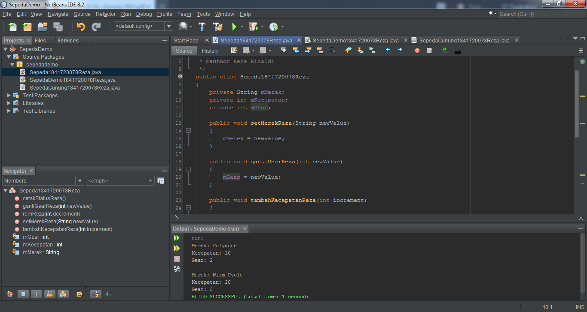
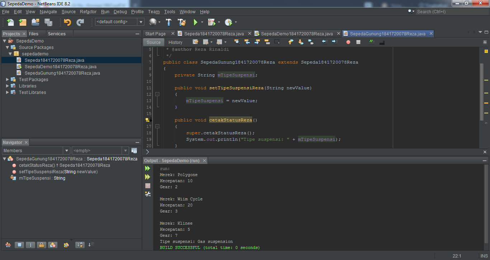
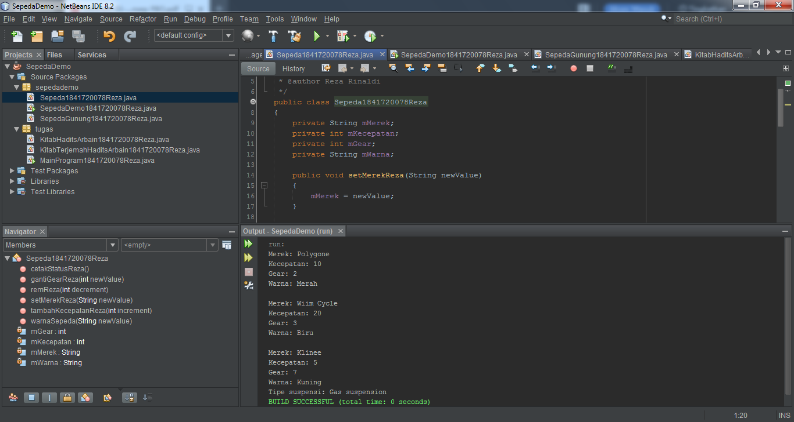
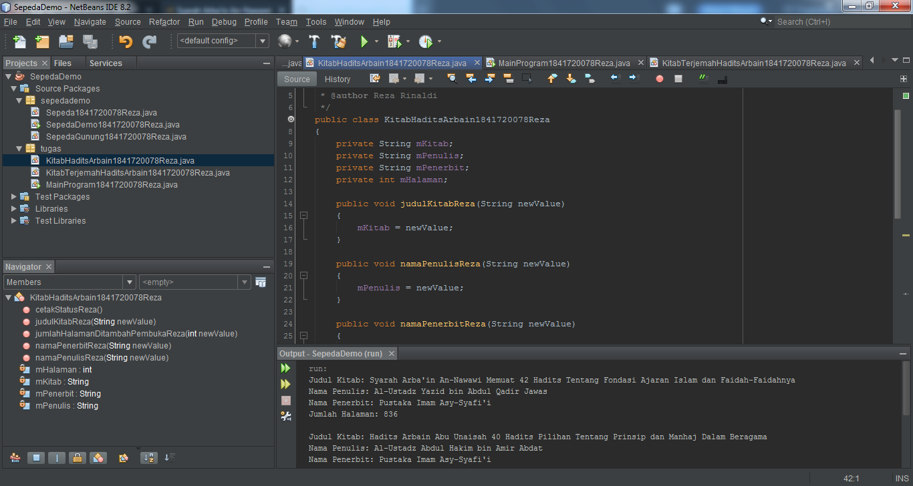
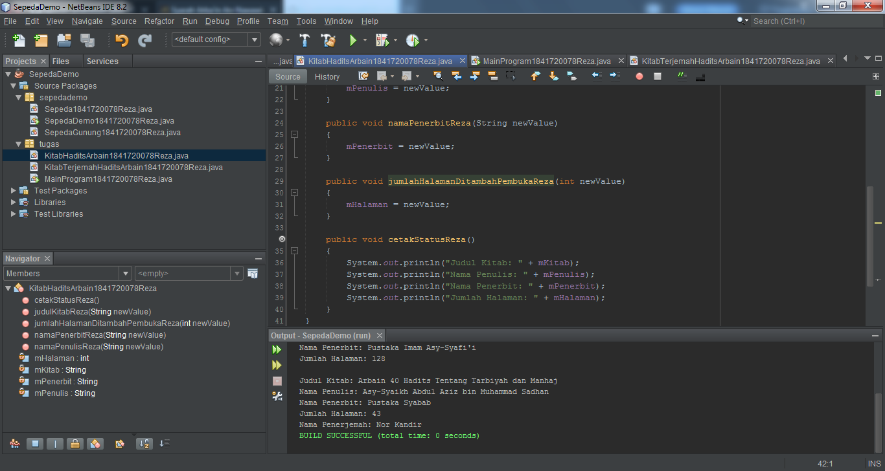
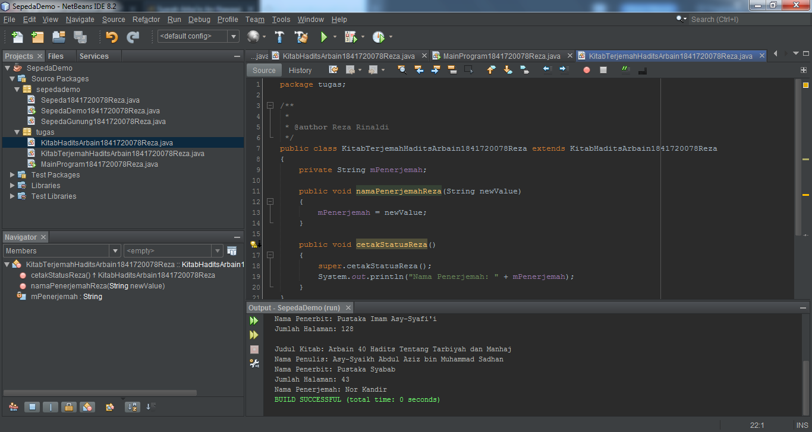
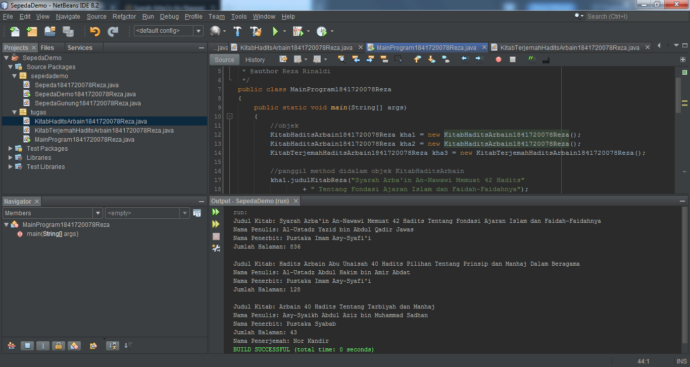

# Laporan Praktikum #1 - Pengantar Konsep PBO

## Kompetensi

1. Perbedaan paradigma berorientasi objek dengan paradigma struktural
2. Konsep dasar PBO

## Ringkasan Materi

Pemrograman berorientasi objek lebih mudah untuk mencari kodingan yang salah secara terperinci, maka 
dapat dipastikan keseluruhan program tidak akan terganggu. Sedangkan yang terstrukur sulit untuk mencarinya, karena kita harus mencarinya satu persatu dan perubahan sedikit fitur saja kemungkinan dapat mengganggu keseluruhan program.

Konsep dari PBO juga mudah untuk dimengerti bagi orang-orang yang masih programmer pemula yang ingin menggeluti materi ini (PBO).

## Percobaan

### Percobaan 1

Didalam percobaan ini, kita akan mendemonstrasikan bagaimana membuat class, membuat object, kemudian mengakses method didalam class tersebut.

`contoh screenshot yang benar, menampilkan 3 komponen, yaitu struktur project, kode program, dan hasil kompilasi`

Link kode program : [Sepeda1841720078Reza](../../src/1_Pengantar_Konsep_PBO/Sepeda1841720078Reza.java)

Link kode program : [SepedaDemo1841720078Reza](../../src/1_Pengantar_Konsep_PBO/SepedaDemo1841720078Reza.java)

### Percobaan 2

Didalam percobaan ini, akan didemonstrasikan salah satu fitur yang paling penting dalam PBO, yaitu inheritance. Disini kita akan membuat class SepedaGunung yang mana adalah turunan/warisan dari class Sepeda. Pada dasarnya class SepedaGunung adalah sama dengan class Sepeda, hanya saja pada sepeda gunung terdapat tipe suspensi. Untuk itu kita tidak perlu membuat class Sepeda Gunung dari nol, tapi kita wariskan saja class Sepeda ke class SepedaGunung.

`contoh screenshot yang benar, menampilkan 3 komponen, yaitu struktur project, kode program, dan hasil kompilasi`

Link kode program : [SepedaGunung1841720078Reza](../../src/1_Pengantar_Konsep_PBO/SepedaGunung1841720078Reza.java)

Link kode program : [SepedaDemo1841720078Reza](../../src/1_Pengantar_Konsep_PBO/SepedaDemo1841720078Reza.java)

## Pertanyaan

**Soal**
1. Sebutkan dan jelaskan aspek-aspek yang ada pada pemrograman berorientasi objek!
2. Apa yang dimaksud dengan object dan apa bedanya dengan class?
3. Sebutkan salah satu kelebihan utama dari pemrograman berorientasi objek dibandingkan 
dengan pemrograman struktural!
4. Pada class Sepeda, terdapat state/atribut apa saja?
5. Tambahkan atribut warna pada class Sepeda.
6. Mengapa pada saat kita membuat class SepedaGunung, kita tidak perlu membuat class nya dari nol?

**Jawab**
1. Didalam PBO dikenal beberapa aspek, yaitu:
   > a) Class, yakni kerangka dasar untuk membuat object.
        *Singkatnya, Class adalah gambaran umum tentang sebuah benda. Contohnya, Manusia. Manusia tidak akan dikatakan manusia, jika
        tidak sesuai dengan aslinya, seperti manusia memiliki kepala, tangan, badan, kaki, dll. Dan bisa dilakukan, seperti mendengar,
        melihat, meraba, mencium, mengecap / merasakan, dll (inilah yang disebut class).
    
   > b) Object, yakni bentuk concrete/ hasil nyata dari class tersebut. Contohnya: Manusia.
        #Faedah ini saya dapatkan dari Bapak Habibie Ed Dien.
    
   > c) Enkapsulasi, yakni pembungkusan state(atribut) dan behaviour menjadi satu object dalam bentuk class untuk menyembunyikan
        beberapa isi / informasi. Proses enkapsulasi memudahkan kita untuk menggunakan sebuah objek dari suatu kelas karena kita tidak
        perlu mengetahui segala hal secara rinci / menyeluruh. Dan kita tidak pusing saat melihat kode sumber yang tidak terstruktur dan
        sulit dipelihara. Penyebutan ini biasa dikatakan *Spaghetti code*
        #Sumber: https://www.youtube.com/watch?v=pTB0EiLXUC8 + sedikit penambahan.
    
   > d) Inheritance, yakni suatu kelas baru dengan mewarisi / menurunkan sifat dari kelas lain yang sudah ada. Dengan konsep pewarisan,         seorang programmer dapat menggunakan kode yang telah ditulisnya pada kelas super berulang kali pada kelas-kelas turunannya tanpa
        harus mengetik ulang semua kode" tersebut.
        #Sumber: https://idcloudhost.com/panduan/mengenal-pengertian-dan-konsep-oop/.
    
   > e) Polymorphism, yakni "banyak bentuk atau banyak cara", dan itu terjadi ketika kita memiliki banyak class yang terkait satu sama
        lain melalui pewarisan. Seperti yang kita sebutkan di bab sebelumnya; Warisan memungkinkan kita mewarisi atribut dan metode dari
        kelas lain. Polimorfisme menggunakan metode-metode itu untuk melakukan tugas yang berbeda. Ini memungkinkan kita untuk melakukan
        satu tindakan dengan berbagai cara. Kata kuncinya adalah satu tindakan yang sama, tetapi memiliki bentuk / cara yang berbeda
        saat melakukannya.
        #Sumber: https://www.w3schools.com/java/java_polymorphism.asp + terjemahan dan sedikit tambahan
    
   > f) Abstraction, yakni suatu cara untuk melihat suatu object dalam bentuk yang lebih sederhana. Dengan Abstraction, suatu sistem
        yang kompleks dapat dipandang sebagai kumpulan subsistem-subsistem yang lebih sederhana.
        #Sumber: https://www.youtube.com/watch?v=pTB0EiLXUC8 + sedikit penambahan
    
2. Object, yakni bentuk concrete/nyata dari class tersebut. Contohnya: Rumah. Perbedaannya: Class saya ilustrasikan seperti denah sebuah
   rumah. Ia menggambarkan denah rumah di atas kertas, meskipun rumahnya belum terwujud. Sedangkan sebuah object adalah seperti rumah
   sebenarnya yang dibangun sesuai dengan denahnya. Di dalamnya meliputi properti seperti kayu, bata, atau genting yang membentuk rumah.
   Tanpa dirakit sesuai dengan denah, itu hanyalah tumpukan barang-barang. Namun, ketika itu semua dikumpulkan bersama-sama, menjadi
   rumah yang terstruktur dan berguna.
   #Faedah ini saya dapatkan dari Bapak Habibie Ed Dien.
   
3. Kelebihan utama dari pemrograman berorientasi objek ini kita cepat untuk mengembakan suatu program karena, sistem yang didevelop
   dengan cara yang baik dan benar pada saat menganalisis dan merancang akan menjadikan coding yang dibuat dapat diminimalisir
   kesalahannya, tanpa harus susah payah untuk mencarinya. Sedangkan yang terstruktur kita akan mencarinya satu" jika ada kesalahan.
   #Sumber: https://www.ayoksinau.com/pengertian-dan-keunggulan-pemrograman-berorientasi-objek-lengkap/ + sedikit penambahan.
   
4. String mMerek, int mKecepatan, dan int mGear.

5. Hasil tambahan atribut warna pada class Sepeda1841720078Reza :

Link kode program : [Sepeda1841720078Reza](../../src/1_Pengantar_Konsep_PBO/Sepeda1841720078Reza.java)

6. Karena, konsep yang kita gunakan adalah Inheritance yang dimana kita dapat menggunakan kode yang telah ditulisnya pada kelas super
   berulang kali pada kelas-kelas turunannya tanpa harus mengetik ulang semua kode" tersebut. Dan pada kodingan SepedaGunung terdapat
   "extends" fungsinya dapat mewarisi semua fungsi dan semua fields (variable) yang ada di dalam kelas parent (Sepeda).

## Tugas

(silakan kerjakan tugas di sini beserta `screenshot` hasil kompilasi program. Jika ada rujukan ke file program, bisa dibuat linknya di sini.)

`contoh screenshot yang benar, menampilkan 3 komponen, yaitu struktur project, kode program, dan hasil kompilasi`

Link kode program : [KitabHaditsArbain1841720078Reza](../../src/1_Pengantar_Konsep_PBO/KitabHaditsArbain1841720078Reza.java)

Link kode program : [MainProgram1841720078Reza](../../src/1_Pengantar_Konsep_PBO/MainProgram1841720078Reza.java)

Link kode program : [KitabTerjemahHaditsArbain1841720078Reza](../../src/1_Pengantar_Konsep_PBO/KitabTerjemahHaditsArbain1841720078Reza.java)

## Kesimpulan

> Dari pertemuan ini, kita telah mendemonstrasikan bagaimana paradigma pemrograman 
berorientasi objek dan mengimplementasikannya kedalam program sederhana. Kita juga telah 
mendemonstrasikan salah satu fitur paling penting dari PBO yaitu inheritance, yaitu dalam hal 
membuat class SepedaGunung. 
Kita ketahui bahwa SepedaGunung pada dasarnya adalah sama dengan Sepeda (memiliki gear, 
memiliki kecepatan, dapat menambah kecepatan, dapat mengerem, pindah gigi, dsb) namun ada 
fitur tambahan yaitu tipe suspensi. Maka kita tidak perlu membuat class SepedaGunung dari nol, 
kita extends atau wariskan saja dari class Sepeda, kemudian kita tinggal tambahkan fitur yang 
sebelumnya belum ada di class Sepeda. Inilah salah satu kelebihan PBO yang tidak ada di 
pemrograman struktural.

> Ada beberapa juga konsep yang dapat ketahui selain dari Inheritance (Pewarisan). Seperti: Ecapsulation, Abstraction, dan Polymorphishm. Yang memiliki berbeda-beda kegunaan. Seperti halnya Polymorphism yang memiliki kegunaan melakukan satu tindakan yang sama, tetapi memiliki bentuk / cara yang berbeda saat melakukannya. Contohnya, ada kucing, serigala. Mereka sama, yakni Binatang. Tetapi memiliki perbedaan saat melakukan. Kucing suaranya mengeluarkan = meow, sedangkan serigala mengeluarkan = auuu, dll. Ini kesimpulan yang saya dapat dari Praktikum sampai Teori PBO waktu teman" menjelaskan presetasinya.

## Pernyataan Diri

Saya menyatakan isi tugas, kode program, dan laporan praktikum ini dibuat oleh saya sendiri. Saya tidak melakukan plagiasi, kecurangan, menyalin/menggandakan milik orang lain.

Jika saya melakukan plagiasi, kecurangan, atau melanggar hak kekayaan intelektual, saya siap untuk mendapat sanksi atau hukuman sesuai peraturan perundang-undangan yang berlaku.

Ttd,

***(Reza Rinaldi)***
