# Laporan Praktikum #2 - Class dan Object

## Kompetensi

* Mahasiswa dapat memahami deskripsi dari class dan object
* Mahasiswa memahami implementasi dari class
* Mahasiswa dapat memahami implementasi dari attribute
* Mahasiswa dapat memahami implementasi dari method
* Mahasiswa dapat memahami implementasi dari proses instansiasi
* Mahasiswa dapat memahami implementasi dari try-catch
* Mahasiswa dapat memahami proses pemodelan class diagram menggunakan UML

## Ringkasan Materi

> a. Kita diajarkan cara membuat class diagram.

> b. Kita diajarkan cara membuat dan mengakses suatu class, dll.

> c. Kita bisa membedakan kegunaan antara ***void*** dan ***int / variable lainnya***. ***Void*** hanya memiliki output,tidak wajib memiliki input (tanpa nilai kembali / return). Sedangkan pada ***Int*** memiliki input, output, dan memiliki return sebagai outputnya (keluaran). Pada ***Int*** juga biasa memiliki parameter maupun tanpa parameter, Sama seperti method ***void*** kita boleh menggunakan parameter maupun tanpa parameter hal ini disesuikan dengan program yang kita butuhkan.

> d. Kita membuat Unified Modeling Language ( UML ) dengan baik, benar.

> e. Kita juga diajarkan memahami dan membuat try-catch.

>* Fungsi dari try-catch sendiri untuk menangani error di Java, digunakan sebuah statement yang bernama try -
catch. Statement tersebut digunakan untuk mengurung eksekusi yang menampilkan 
error dan dapat membuat program tetap berjalan tanpa dihentikan secara langsung. 
Error yang ditangani oleh try – catch biasa disebut dengan ***exception***.

## Percobaan 1

Dalam suatu perusahaan salah satu data yang diolah adalah data karyawan. **Setiap karyawan memiliki id, nama, jenis kelamin, jabatan, jabatan, dan gaji**. ***Setiap karyawan juga bisa menampilkan data diri pribadi dan melihat gajinya***.

### Soal Percobaan 1

1. Gambarkan desain class diagram dari studi kasus 1!,
2. Sebutkan Class apa saja yang bisa dibuat dari studi kasus 1!,
3. Sebutkan atribut beserta tipe datanya yang dapat diidentifikasi dari masing-masing class dari studi kasus 1!
4. Sebutkan method-method yang sudah anda buat dari masing-masing class pada studi kasus 1!
 
Jawab:
 
1. Gambar desain class diagram:
> 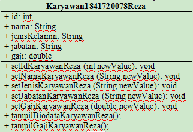

2. Class yang dibuat:
>* Class 'Karyawan' dan Class (Main) sebagai pemanggil / menjalankan program.

3. Atribut dan Tipe data yang digunakan pada class Karyawan:
>* +id: int,
>* +nama: String,
>* +jenisKelamin: String,
>* +jabatan: String,
>* +gaji: double.

4. Method-method yang dibuat:
> Karyawan:
>* +setIdKaryawan(): int,
>* +setNamaKaryawan(): String,
>* +setJenisKelamin(): String,
>* +setJabatanKaryawan(): String,
>* +setGajiKaryawan(): double,
>* +tampilBiodataKaryawan(): void,
>* +tampilGajiKaryawan(): void.
> MainProgram:
>* +main (String[]args): void

## Percobaan 2

Membuat dan mengakses anggota suatu class, pada percobaan praktikum ini menjelaskan instansisasi objek dan bagaiamana cara penggunaannya.

### Soal Percobaan 2

6. Jalankan class TestMahasiswa.java
7. Jelaskan pada bagian mana proses pendeklarasian atribut pada program diatas!
8. Jelaskan pada bagian mana proses pendeklarasian method pada program diatas!
9. Berapa banyak objek yang di instansiasi pada program diatas!
10. Apakah yang sebenarnya dilakukan pada sintaks program “mhs1.nim=101” ?
11. Apakah yang sebenarnya dilakukan pada sintaks program “mhs1.tampilBiodata()” ?
12. Instansiasi 2 objek lagi pada program diatas!

Jawab:
6. Screenshot:
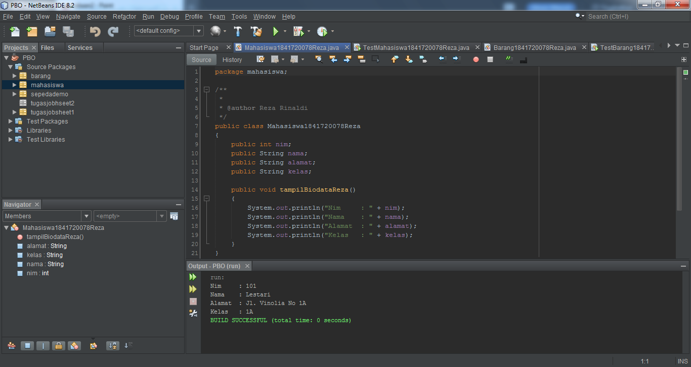
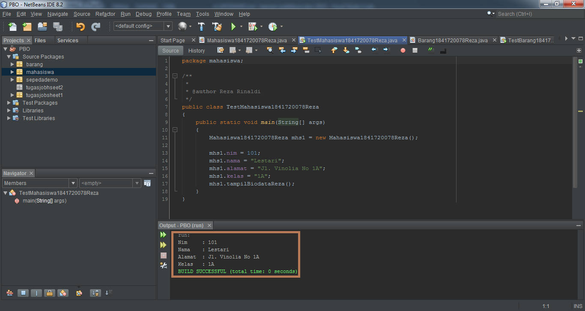

7. Pada bagian class Mahasiswa, yakni dibawah method **public class Mahasiswa**:
> 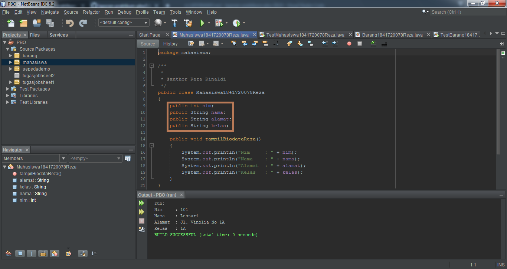

8. Pada bagian class Mahasiswa, yakni dibawah method **public void tampilBiodata**:
> 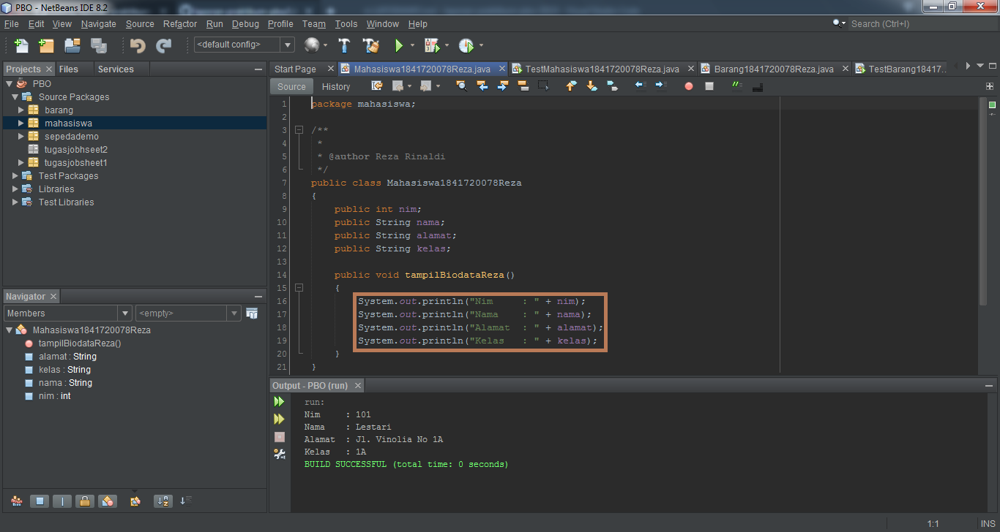

9. Objek yang di instansiasi hanya 1 (satu)

10. Mengisi atribut nim dari class **Mahasiswa** dengan value '101'

11. Memanggil method **tampilBiodata()**

12. Menambah instansiasi 2 objek pada class **TestMahasiswa**:
> 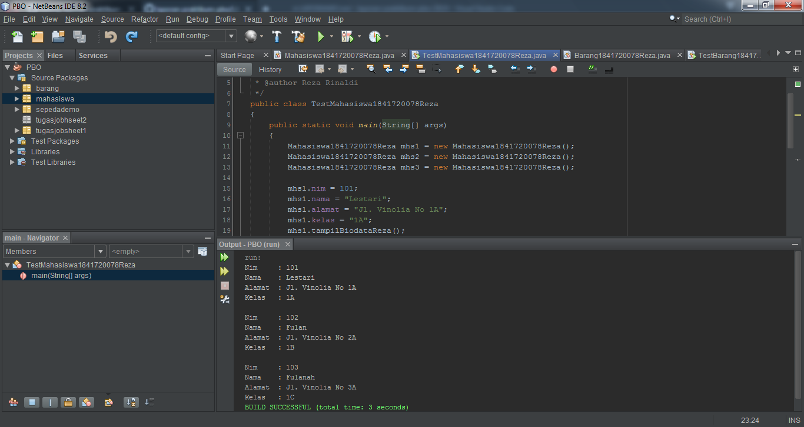

Link kode program : [Mahasiswa1841720078Reza](../../src/2_Class_dan_Object/Mahasiswa1841720078Reza.java)

Link kode program : [TestMahasiswa1841720078Reza](../../src/2_Class_dan_Object/TestMahasiswa1841720078Reza.java)

## Percobaan 3

Menulis method yang memiliki argument/parameter dan memiliki return

### Soal Percobaan 3

6. Jalankan program tersebut!
7. Apakah fungsi argumen dalam suatu method?
8. Ambil kesimpulan tentang kegunaan dari kata kunci return, dan kapan suatu method harus memiliki return!
   
Jawab:

6. Screenshot:
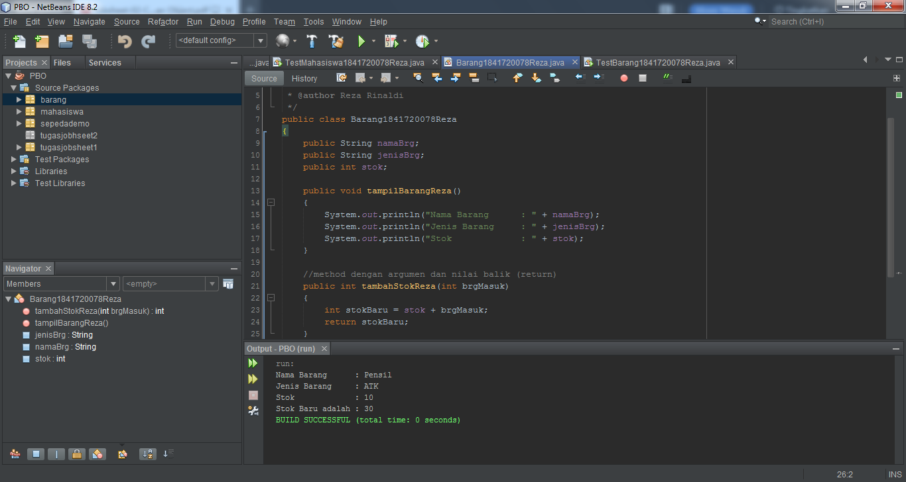
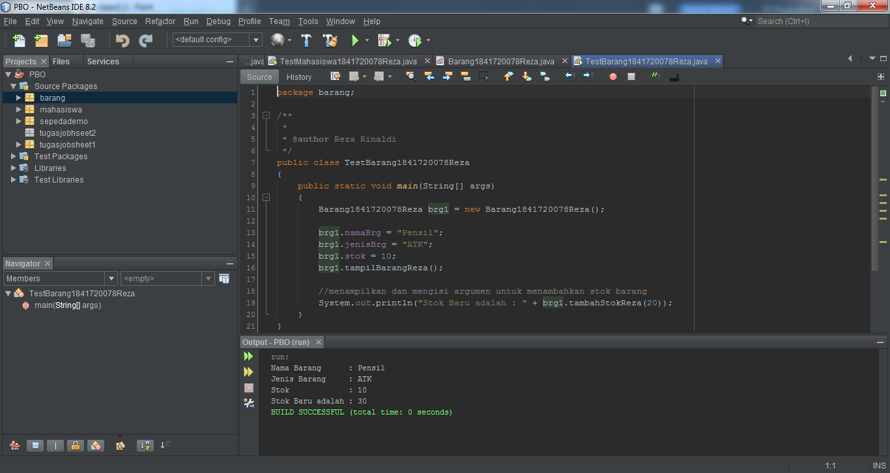

7. Argumen atau yang biasa disebut **Parameter**, berfungsi untuk memberikan nilai yang harus dieksekusi dalam fungsi tersebut. Perlu diingat argumen atau parameter tidak harus ada didalam sebuah fungsi (bersifat opsional).
*Sumber: https://tutorkeren.com/artikel/ringkasan-mengenal-istilah-fungsi-atau-method-dalam-program.htm

8. > Return biasa digunakan untuk mengembalikan nilai kedalam fungsi itu sendiri. Intinya nilai yang dikembalikan akan
     disimpan dalam nama method.

   > Return digunakan pada saat method membutuhkan nilai (data) dikembalikan yang bisa disimpan dalam nama
     method. Inilah sebabnya kita dapat mencetak atau memindahkan nilai dari method return kedalam variabel. Meskipun demikian, sebenarnya saya bisa saja langsung mencetaknya.
     *Sumber: https://www.kodedasar.com/method-java/

Link kode program : [Barang1841720078Reza](../../src/2_Class_dan_Object/Barang1841720078Reza.java)

Link kode program : [TestBarang1841720078Reza](../../src/2_Class_dan_Object/TestBarang1841720078Reza.java)

## Tugas

1. Jawab:
> 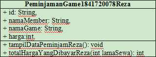

2. Jawab:

Penjelasan program yang saya buat dari soal tugas no. 1:
* Nama game yang disewakan / dipinjamkan disini ada 3 game, yakni: ***Memanah, Balapan Kuda, dan Balapan Renang***.
* Game yang disewakan berbeda-beda harga, yakni: **Memanah: Rp. 4000(perhari), Balapan Kuda: Rp. 5000(perhari), dan Balapan Renang: Rp. 6000(perhari)**.

> 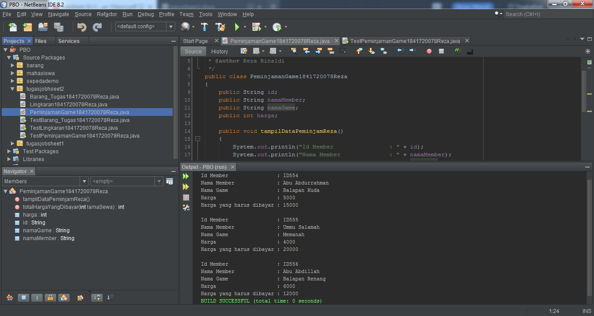
> 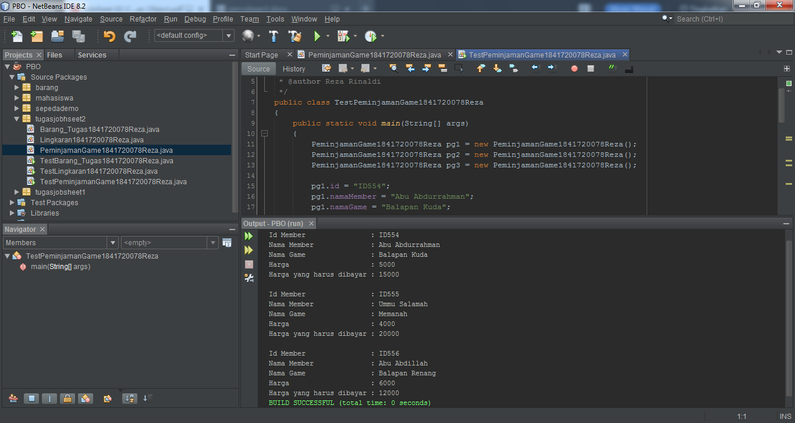

Link kode program : [PeminjamanGame1841720078Reza](../../src/2_Class_dan_Object/PeminjamanGame1841720078Reza.java)

Link kode program : [TestPeminjamanGame1841720078Reza](../../src/2_Class_dan_Object/TestPeminjamanGame1841720078Reza.java)

3. Jawab:
> 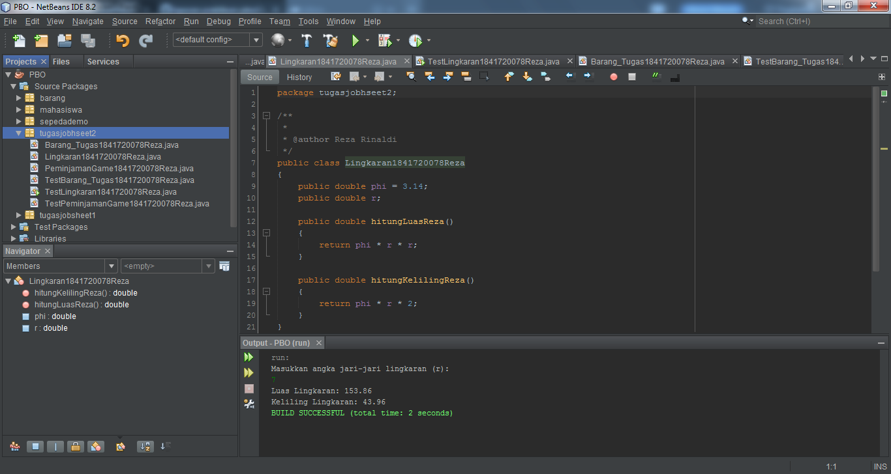
> 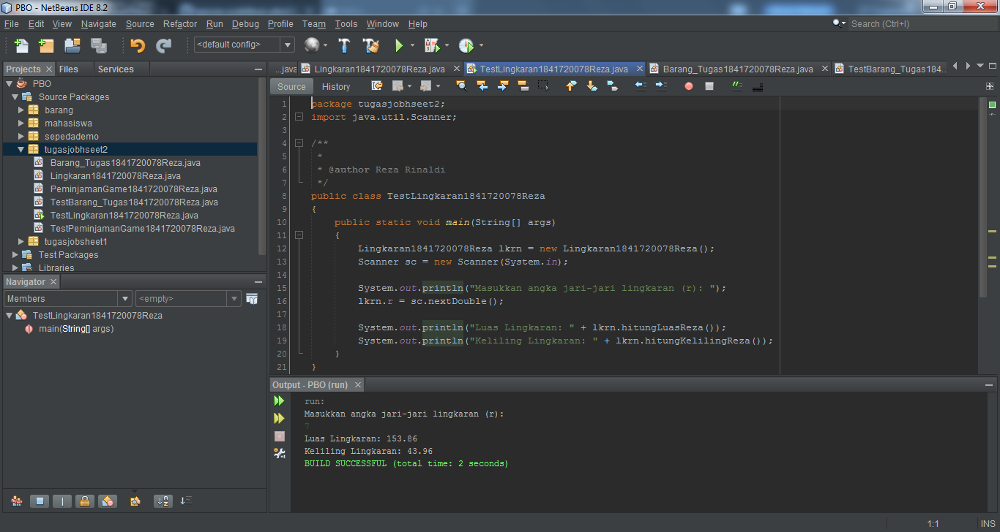

Link kode program : [Lingkaran1841720078Reza](../../src/2_Class_dan_Object/Lingkaran1841720078Reza.java)

Link kode program : [TestLingkaran1841720078Reza](../../src/2_Class_dan_Object/TestLingkaran1841720078Reza.java)

4. Jawab:
> 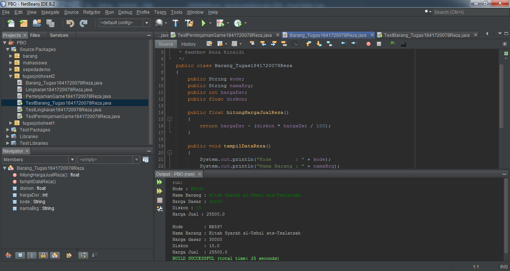
> 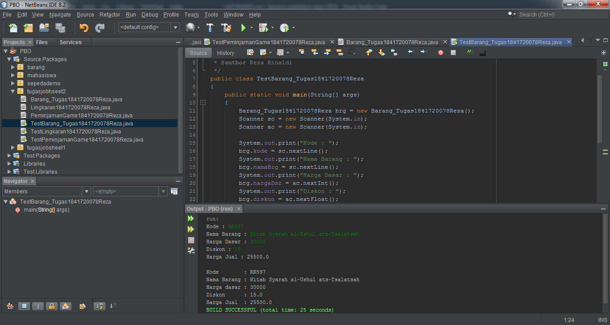

Link kode program : [Barang_Tugas1841720078Reza](../../src/2_Class_dan_Object/Barang_Tugas1841720078Reza.java)

Link kode program : [TestBarang_Tugas1841720078Reza](../../src/2_Class_dan_Object/TestBarang_Tugas1841720078Reza.java)

## Kesimpulan

Pada pertemuan ke-2 ini, Pak Habibie memberi berberapa faedah pada pertemuan Praktikum & Teori seperti :

> Bahwasannya, 2 class (parent) sekaligus bisa memanggil anaknya (main), dengan menggunakan ***Implements*** (multiple_class), tetapi itu akan terjadi yang namanya diamond problem (ambigu) saat pemanggilan.

> Saya belajar cara membuat konstruktor pada class utama dengan cepat, fungsinya untuk memudahkan pada class main tidak mengetik object kembali. Dengan cara "klik kanan" pada class yang ingin di konstruktor. Lalu klik ***Insert Code...*** /tekan tombol Alt+Ins, kemudian pilih ***Constructor...***, kemudian pilih parameter yang ingin dibuat konstruktor, terakhir klik ***Generate***.

> Beliau juga memberi sedikit acuan kepada mahasiswa untuk membuat dokumen yang rapi agar pembaca mudah untuk membacanya. Karena percuma seorang programmer bisa membuat sebuah program bahkan ahli, tetapi dalam hal dokumentasi dia tidak baik, benar ataupun rapi. Itu bisa mengakibatkan orang-orang yang ingin membaca, tidak mengetahui apa yang dimaksud oleh si pembuat program, bahkan yang membuat sendiri tidak mengerti apa yang ia buat.

## Pernyataan Diri

Saya menyatakan isi tugas, kode program, dan laporan praktikum ini dibuat oleh saya sendiri. Saya tidak melakukan plagiasi, kecurangan, menyalin/menggandakan milik orang lain.

Jika saya melakukan plagiasi, kecurangan, atau melanggar hak kekayaan intelektual, saya siap untuk mendapat sanksi atau hukuman sesuai peraturan perundang-undangan yang berlaku.

Ttd,

***(Reza Rinaldi)***
