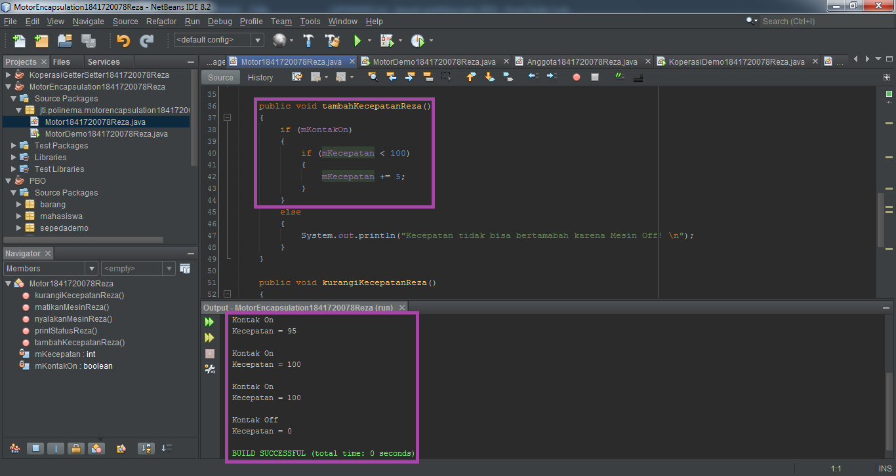

# Laporan Praktikum #3 - Enkapsulasi

## Kompetensi

1. Konstruktor
2. Akses Modifier
3. Atribut/method pada class
4. Intansiasi atribut/method
5. Setter dan getter
6. Memahami notasi pada UML Class Diagram

## Ringkasan Materi

> **Enkapsulasi** disebut juga dengan **information-hiding**. Dalam berinteraksi dengan objek, seringkali 
kita tidak perlu mengetahui kompleksitas yang ada didalamnya. Hal ini akan lebih mudah dipahami 
jika kita membayangkan atau menganalisa objek yang ada disekitar kita

>* Misalnya objek penghisap debu, ketika kita mencolokkan kabel penghisap debu 
dan menyalakan sakelarnya maka mesin tersebut siap digunakan untuk menghisap debu. Dalam 
proses tersebut kita tidak mengetahui proses rumit yang terjadi ketika mengubah listrik menjadi 
tenaga dari penghisap debu. Dalam contoh diatas penghisap debu telah menerapkan 
enkapsulasi atau disebut juga **information-hiding atau data hiding** karena menyembunyikan detail 
proses suatu objek dari pengguna.

> **Konstruktor** mirip dengan method cara deklarasinya akan tetapi tidak memiliki tipe return. Dan 
konstruktor dieksekusi ketika instan dari objek dibuat. Jadi setiap kali sebuat objek dibuat dengan 
keyword new() maka konstruktor akan dieksekusi. Cara untuk membuat konstruktor adalah sebagai 
berikut:
1. Nama konstruktor harus sama dengan nama class
2. Konstruktor tidak memiliki tipe data return
3. Konstruktor tidak boleh menggunakan modifier abstract, static, final, dan syncronized

> **Akses Modifier**. Terdapat 2 tipe modifier di java yaitu : akses modifier dan non-access modifier. Dalam hal ini kita 
akan fokus pada akses modifier yang berguna untuk mengatur akses method, class, dan constructor. 
Terdapat 4 akses modifier yaitu:
>* ***private***;
>* ***default***;
>* ***protected***; dan
>* ***public***.

## Percobaan
## Percobaan 1 - Enkapsulasi

Didalam percobaan 1 ini menggunakan konsep enkapsulasi. Buatlah class Motor yang memiliki atribut kecepatan dan kontakOn, dan memiliki method printStatus(); untuk menampilkan status motor dan ditampilkan pada class MotorDemo (main).

Hasilnya adalah sebagai berikut:
> 
> 
> 
## Percobaan 2 - Access Modifier

Pada percobaan ini akan digunakan ***access modifier*** untuk memperbaiki cara kerja class Motor pada percobaan ke-1.

Implementasi class Motor adalah sebagai berikut:
> 

Kemudian pada class MotorDemo, ubah code menjadi seperti berikut. Hasilnya dari class MotorDemo adalah sebagai berikut:

> 

Link kode program : [Motor1841720078Reza](../../src/3_Enkapsulasi/Motor1841720078Reza.java)

Link kode program : [MotorDemo1841720078Reza](../../src/3_Enkapsulasi/MotorDemo1841720078Reza.java)

### Pertanyaan - Percobaan 2

1. Pada class MotorDemo, saat kita menambah kecepatan untuk pertama kalinya, mengapa muncul peringatan “Kecepatan tidak bisa bertambah karena Mesin Off!”? 
2. Mengapa atribut kecepatan dan kontakOn diset private?
3. Ubah class Motor sehingga kecepatan maksimalnya adalah 100!

Jawab:

1. Karena awal mula dari program (Motor) tersebut masih dalam keadaan mati(off), maka perlunya kita memanggil method **motor.nyalakanMesin()** pada class MotorDemo. Agar bisa menambah kecepatan pada saat kita menambahkan method **tambahKecepatan()** pada class MotorDemo.

2. - Untuk meningkatkan keamanan data;
   - Agar lebih mudah dalam mengontrol atribut dan method;
   - Class bisa kita buat menjadi read-only dan write-only;
   - dan fleksibel: programmer dapat mengganti sebagian dari kode tanpa harus takut berdampak pada kode yang lain.
- Sumber : https://www.petanikode.com/java-oop-setter-getter/

3. Hasil output setelah mengubah sehingga kecepatan maksimalnya hanya 100:
> 
> 

Link kode program : [Motor1841720078Reza](../../src/3_Enkapsulasi/Motor1841720078Reza.java)

## Percobaan 3 - Getter dan Setter

Menulis method yang memiliki argument/parameter dan memiliki return

class Anggota dibawah ini:
> 

class KoperasiDemo untuk mencoba class Anggota. Hasil dari main method:
> 

## Percobaan 4 - Konstruktor Instansiasi

Mengubah kode class Anggota pada percobaan ke-3:
> 
> 
Mengubah kode class KoperasiDemo pada percobaan ke-3:
> 

Link kode program : [Anggota1841720078Reza](../../src/3_Enkapsulasi/Anggota1841720078Reza.java)

Link kode program : [KoperasiDemo1841720078Reza](../../src/3_Enkapsulasi/KoperasiDemo1841720078Reza.java)

### Pertanyaan - Percobaan 3 dan 4

1. Apa yang dimaksud getter dan setter?
2. Apa kegunaan dari method getSimpanan()?
3. Method apa yang digunakan untk menambah saldo?
4. Apa yand dimaksud konstruktor?
5. Sebutkan aturan dalam membuat konstruktor?
6. Apakah boleh konstruktor bertipe private?
7. Kapan menggunakan parameter dengan passsing parameter?
8. Apa perbedaan atribut class dan instansiasi atribut?
9. Apa perbedaan class method dan instansiasi method?
   
Jawab:

1. - **Getter** adalah public method dan memiliki tipe  data return, yang fungsinya untuk mendapatkan nilai 
dari atribut private.
   - **Setter** adalah public method yang tidak memliki tipe data return, yang fungsinya untuk memanipulasi nilai dari atribut private.

2. Kegunaan dari method getSimpanan() untuk menyimpan data transaksi berapa uang yang disetorkan ataupun dipinjam.
3. Method **setorReza()**
4. Konstruktor yakni sebuah method yang namanya sama persis dengan nama class-nya itu sendiri.
5. - Nama konstruktor harus sama dengan nama class,
   - Konstruktor tidak memiliki tipe data return,
   - dan konstruktor tidak boleh menggunakan modifier abstract, static, final, dan syncronized.
6. Tidak boleh, jika konstruktor bertipe private maka objek tidak bisa diakes / tidak bisa di instansiasi oleh class lain.
7. Jika kita menggunakan konstruktor pada class maka sebaiknya kita menggunakan passing parameter pada class mainnya, begitu juga sebaliknya.
8. **Attribute dari sebuah class** adalah variabel global yang dimiliki sebuah class, sedangkan **instansiasi atribut** adalah atribut yang didefinisikan di dalam suatu metode dan hanya menjadi milik dari instance class itu sendiri.
9. **Class method** adalah method yang terikat dengan kelas lain dan itu bukan objek class. Sedangkan **instansiasi method** adalah metode pembuatan objek, lalu dikenalkan dengan kelas lain, dan mengenalkannya dengan objek class-nya.

## Kesimpulan

> Dari percobaan diatas, telah dipelajari konsep dari enkapsulasi, kontruktor, access modifier yang 
terdiri dari 4 jenis yaitu public, protected, default dan private. Konsep atribut atau method class 
yang ada di dalam blok code class dan konsep instansiasi atribut atau method. Cara penggunaan 
getter dan setter beserta fungsi dari getter dan setter. Dan juga telah dipelajari atau memahami 
notasi UML.

Pada pertemuan ke-3 ini, Pak Habibie memberi sedikit faedah yang saya dapatkan pada pertemuan Praktikum & Teori seperti :

> Bahwasannya if tidak perlu di beri kondisi true lagi, karena if itu selalu true (pada statement yang dieksekusi). Sedangkan else itu selalu false (pada statement yang dieksekusi).

> Perbedaan dari interface dengan abstract class dalam Java. Seperti:
>- Abstract Class, bisa berisi abstract dan non-abstract method. Sedangkan interface, hanya boleh berisi abstract method saja.
>- Abstract Class, kita harus menuliskan sendiri modifiernya. Sedangkan interface, Kita tidak perlu susah2 menulis public abstract di depan nama method. Karena secara implisit, modifier untuk method di interface adalah public dan abstract.
>- Abstract Class, suatu abstact class hanya bisa meng-extend satu abstract class lainnya.	Sedangkan interface, suatu interface bisa meng-extend  satu atau lebih interface lainnya.

## Tugas

1. Hasil outputnya:
> 
> 

2. Pada program diatas, pada class EncapTest kita mengeset age dengan nilai 35, namun pada saat ditampilkan ke layar nilainya 30, jelaskan mengapa.

>- Jawab:
>* Karena pada class EncapDemo dalam method setAge, **if(newAge > 30)** menandakan bahwa umur tidak bisa melebihi angka 30, Nilai 30 adalah angka maksimal. Melainkan jika memasukkan nilai kurang dari 30 maka hasilnya akan muncul.

3. Ubah program diatas agar atribut age dapat diberi nilai maksimal 30 dan minimal 18.

>- Jawab:

Penjelasan program:

>* Umur yang saya berikan pada James adalah 35, maka akan muncul "Nilai yang anda masukan salah!!" dan nilainya akan 0, karena batas maksimal yang diberikan umur 30. Seperti gambar dibawah ini:
>* 
>* 

* Jika umur yang saya berikan pada James adalah 19, maka akan muncul seperti gambar dibawah ini:
>* 

Link kode program : [EncapDemo1841720078Reza](../../src/3_Enkapsulasi/EncapDemo1841720078Reza.java)

Link kode program : [EncapTest1841720078Reza](../../src/3_Enkapsulasi/EncapTest1841720078Reza.java)

4. Hasil outputnya:
> 
> 
> 

5. Modifikasi soal no. 4 agar nominal yang dapat diangsur minimal adalah 10% dari jumlah 
pinjaman saat ini. Jika mengangsur kurang dari itu, maka muncul peringatan “Maaf, 
angsuran harus 10% dari jumlah pinjaman”.

Hasil setelah dimodifikasi soal no. 4:
> 
> 

6. Modifikasi class TestKoperasi, agar jumlah pinjaman dan angsuran dapat menerima input 
dari console.

Hasil setelah dimodifikasi class TestKoperasi:
> 
> 

Link kode program : [Anggota_Tugas1841720078Reza](../../src/3_Enkapsulasi/Anggota_Tugas1841720078Reza.java)

Link kode program : [TestKoperasi1841720078Reza](../../src/3_Enkapsulasi/TestKoperasi1841720078Reza.java)

## Pernyataan Diri

Saya menyatakan isi tugas, kode program, dan laporan praktikum ini dibuat oleh saya sendiri. Saya tidak melakukan plagiasi, kecurangan, menyalin/menggandakan milik orang lain.

Jika saya melakukan plagiasi, kecurangan, atau melanggar hak kekayaan intelektual, saya siap untuk mendapat sanksi atau hukuman sesuai peraturan perundang-undangan yang berlaku.

Ttd,

***(Reza Rinaldi)***
