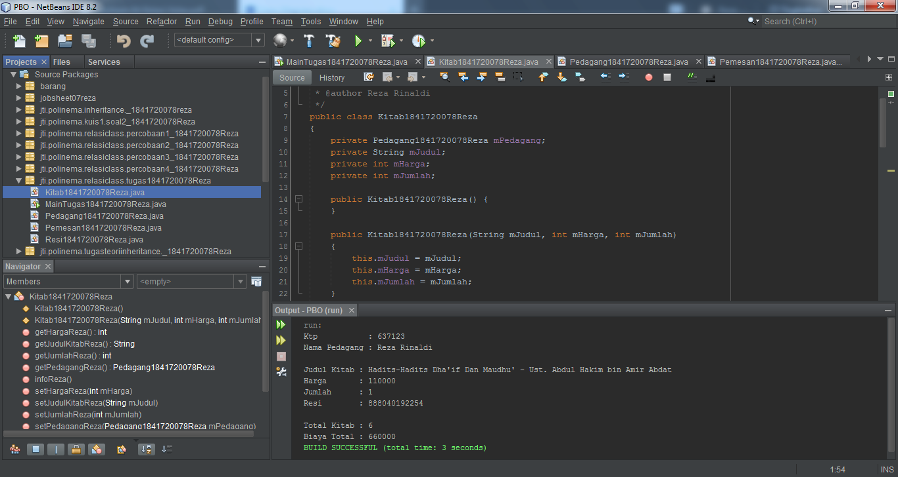

# Laporan Praktikum #4 - Relasi Kelas

## Kompetensi

1. Memahami konsep relasi kelas.
2. Mengimplementasikan relasi has‑a dalam program.

## Ringkasan Materi

Pada kasus yang lebih kompleks, dalam suatu sistem akan ditemukan lebih dari satu class yang saling memiliki keterkaitan antara class satu dengan yang lain. Pada percobaan‑percobaan sebelumnya, mayoritas kasus yang sudah dikerjakan hanya fokus pada satu class saja. Pada 
jobsheet ini akan dilakukan percobaan yang melibatkan beberapa class yang saling berelasi.

Misalnya terdapat class Laptop yang memiliki atribut berupa merk dan prosesor. Jika diperhatikan lebih rinci,maka atribut prosesor sendiri didalamnya memiliki data berupa merk, nilai cache memori, dan nilai clock‑nya. Artinya, ada class lain yang namanya Processor yang memiliki atribut merk, cache dan clock, dan atribut prosesor yang ada di dalam class Laptop itu merupakan objek dari class Proceessor tersebut. Sehingga terlihat antara class Laptop dan class Processor memiliki ***relasi (has‑a)***.

Jenis ***relasi has‑a*** ini yang akan dicontohkan pada percobaan di jobsheet ini. Apabila dilihat lebih rinci lagi, relasi tersebut disebut juga dengan ***agregasi (has-a)***. Relasi antar kelas yang lain adalah ***dependensi (uses-a)*** dan ***inheritance (is-a)***.

## Percobaan

### Percobaan 1

Didalam percobaan ini, akan dibuat 2 class. Class Processor dan Class Laptop. Dan atribut prosesor yang ada di dalam class Laptop itu 
merupakan objek dari class Proceessor tersebut. 

Kedua class tersebut digambarkan dengan diagram class di bawah ini:


Didapatkan hasil seperti berikut:


Link kode program : 

[MainPercobaan1_1841720078Reza](../../src/4_Relasi_Class/MainPercobaan1_1841720078Reza.java)

[Processor1841720078Reza](../../src/4_Relasi_Class/Processor1841720078Reza.java)

[Laptop1841720078Reza](../../src/4_Relasi_Class/Laptop1841720078Reza.java)

### Pertanyaan Percobaan 1

1. Di dalam class Processor dan class Laptop, terdapat method setter dan getter untuk masing‑masing atributnya. Apakah gunanya method setter dan getter tersebut ?
2. Di dalam class Processor dan class Laptop, masing‑masing terdapat konstruktor default dan konstruktor berparameter. Bagaimanakah beda penggunaan dari kedua jenis konstruktor tersebut ?
3. Perhatikan class Laptop, di antara 2 atribut yang dimiliki (merk dan proc), atribut manakah yang bertipe object ?
4. Perhatikan class Laptop, pada baris manakah yang menunjukan bahwa class Laptop memiliki relasi dengan class Processor ?
5. Perhatikan pada class Laptop, Apakah guna dari sintaks proc.info() ?
6. Pada class MainPercobaan1, terdapat baris kode:
Laptop l = new Laptop("Thinkpad", p);.
Apakah p tersebut ? Dan apakah yang terjadi jika baris kode tersebut diubah menjadi:

**Jawab:**
1. * Kegunaan method **setter** hanya untuk mengisi data /
     nilai ke dalam atribut private.

   * Sedangkan method **getter** untuk mendapatkan/
     mengambil data / nilai dari atribut private.
2. * **Konstruktor Default**, yakni konstruktor yang tidak mempunyai parameter. Jadi saat kita memanggil sebuah method kita harus mengetikan isi dari method melalui objek yang telah dikenalkan ke main class.

   * **Konstruktor Berparameter**, yakni konstruktor yang mempunyai 1 parameter bahkan lebih. Jadi saat kita memanggil method kita tidak lagi mengetikan isinya. Karena sudah diisi pada saat pengenalan objek ke main class.

3. Atribut yang bertipe objek adalah **proc**
4. Pada baris ke 15 dari class Laptop:
   
5. Untuk memanggil method info() yang berupa atribut Merk & Cache, dari class Processor. Dan proc sendiri maksudnya nama dari objek class Processor.
6. Hasil dari instansiasi class Processor yang telah diisikan terlebih dahulu, sebelum menginstansiasi class Laptop.

### Percobaan 2

Didalam percobaan ini. Class Pelanggan bisa 
menyewa mobil sekaligus sopir. Biaya sopir dan biaya sewa mobil dihitung per hari.

Berikut ini adalah gambar class diagram pada percobaan 2 :


Didapatkan hasil seperti berikut:


Link kode program : 

[MainPercobaan2_1841720078Reza](../../src/4_Relasi_Class/MainPercobaan2_1841720078Reza.java)

[Mobil1841720078Reza](../../src/4_Relasi_Class/Mobil1841720078Reza.java)

[Sopir1841720078Reza](../../src/4_Relasi_Class/Sopir1841720078Reza.java)

[Pelanggan1841720078Reza](../../src/4_Relasi_Class/Pelanggan1841720078Reza.java)

### Pertanyaan Percobaan 2

1. Perhatikan class Pelanggan. Pada baris program manakah yang menunjukan bahwa class Pelanggan memiliki relasi dengan class Mobil dan class Sopir ?
2. Perhatikan method hitungBiayaSopir pada class Sopir, serta method hitungBiayaMobil pada class Mobil. Mengapa menurut Anda method tersebut harus memiliki argument hari ?
3. Perhatikan kode dari class Pelanggan. Untuk apakah perintah mobil.hitungBiayaMobil(hari) dan sopir.hitungBiayaSopir(hari) ?
4. Perhatikan class MainPercobaan2. Untuk apakah sintaks p.setMobil(m) dan p.setSopir(s) ?
5. Perhatikan class MainPercobaan2. Untuk apakah proses p.hitungBiayaTotal() tersebut ?
6. Perhatikan class MainPercobaan2, coba tambahkan pada baris terakhir dari method main dan amati perubahan saat di‑run!
    ```java
    System.out.println(p.getMobil().getMerk());
    ```
    Jadi untuk apakah sintaks p.getMobil().getMerk() yang ada di dalam method main tersebut?

**Jawab:**
1. Pada baris ke 27 & 37 pada class Pelanggan:
   

2. Untuk menghitung harga mobil dan sopir yang disewa perhari-nya.
3. Untuk menghitung total biaya yang harus dibayar oleh Pelanggan.
4. Untuk memanggil class Mobil dan Sopir yang telah di instansiasi menjadi object **s dan m** pada class MainPercobaan.
5. Menghitung jumlah biaya total sewa Mobil dan Sopir berdasarkan banyak hari dari Pelanggan.
6. Sintaks program yang telah ditambahkan:
   
Sintaks p.getMobil().getMerk() untuk menampilkan merk mobil yang di sewa oleh Pelanggan.

### Percobaan 3

Pada percobaan‑percobaan sebelumnya, relasi dalam class dinyatakan dalam one‑to‑one. Tetapi ada 
kalanya relasi class melibatkan lebih dari satu. Hal ini disebut dengan multiplicity.

Sebuah Kereta Api dioperasikan oleh Masinis serta seorang Asisten Masinis. Baik Masinis 
maupun Asisten Masinis keduanya merupakan Pegawai PT. Kereta Api Indonesia.

Dari ilustrasi cerita tersebut, dapat digambarkan dalam diagram kelas sebagai berikut:


Didapatkan hasil seperti berikut:


Link kode program : 

[MainPercobaan3_1841720078Reza](../../src/4_Relasi_Class/MainPercobaan3_1841720078Reza.java)

[Pegawai1841720078Reza](../../src/4_Relasi_Class/Pegawai1841720078Reza.java)

[KeretaApi1841720078Reza](../../src/4_Relasi_Class/KeretaApi1841720078Reza.java)

### Pertanyaan Percobaan 3

1. Di dalam method info() pada class KeretaApi, baris this.masinis.info() dan this.asisten.info() digunakan untuk apa ?
2. Buatlah main program baru dengan nama class MainPertanyaan pada package yang sama. Tambahkan kode berikut pada method main() !
    ```java
    Pegawai masinis = new Pegawai("1234", "Spongebob 
    Squarepants");
    KeretaApi keretaApi = new KeretaApi("Gaya Baru", "Bisnis", masinis);

    System.out.println(keretaApi.info());
    ```
3. Apa hasil output dari main program tersebut ? Mengapa hal tersebut dapat terjadi ?
4. Perbaiki class KeretaApi sehingga program dapat berjalan !

**Jawab:**
1. Untuk menampilkan data Masinis dan data Asisten dari class Pegawai.
2. Class baru yang sudah ditambahkan sintaks:
   
3. Akan terjadi error, karena ada variabel yang tidak bernilai(null), dan variabel tersebut adalah objek Asisten pada class KeretaApi1841720078Reza.
4. Class KeretaApi yang telah di perbaiki:
   

    Class MainPertanyaan:
    

Link kode program : [MainPertanyaan1841720078Reza](../../src/4_Relasi_Class/MainPertanyaan1841720078Reza.java)

### Percobaan 4

Pada percobaan 4 ini, percobaan yang dilakukan hampir sama seperti percobaan 3. Hanya saja berbeda diagram class dan tanpa studi kasus. Pada percobaan 4 ini kita juga belajar bagaimana membuat object array dengan tipe data class.

Berikut ini adalah diagram class pada percobaan 4 :


Didapatkan hasil seperti berikut:


Link kode program : 

[MainPercobaan4_1841720078Reza](../../src/4_Relasi_Class/MainPercobaan4_1841720078Reza.java)

[Penumpang1841720078Reza](../../src/4_Relasi_Class/Penumpang1841720078Reza.java)

[Kursi1841720078Reza](../../src/4_Relasi_Class/Kursi1841720078Reza.java)

[Gerbong1841720078Reza](../../src/4_Relasi_Class/Gerbong1841720078Reza.java)

### Pertanyaan Percobaan 4

1. Pada main program dalam class MainPercobaan4, berapakah jumlah kursi dalam Gerbong A ?
2. Perhatikan potongan kode pada method info() dalam class Kursi. Apa maksud kode tersebut ?
    ```java
    ...
    if (this.penumpang != null) {
    info += "Penumpang: " + penumpang.info() + "\n";
    }
    ...
    ```
3. Mengapa pada method setPenumpang() dalam class Gerbong, nilai nomor dikurangi dengan angka 1 ?
4. Instansiasi objek baru budi dengan tipe Penumpang, kemudian masukkan objek baru tersebut pada gerbong dengan gerbong.setPenumpang(budi, 1). Apakah yang 
terjadi ?
5. Modifikasi program sehingga tidak diperkenankan untuk menduduki kursi yang sudah ada penumpang lain !
   
**Jawab:**
1. Jumlah kursi dalam Gerbong A : **10**
   
2. Jika object penumpang dari class Kursi1841720078Reza memiliki nilai, maka kita harus menambahkan nilai method pada infoReza() pada class Penumpang1841720078Reza ke method infoReza() class Kursi1841720078Reza.
3. Karena nomor berfungsi untuk memberikan nilai indeks pada array, yang dimana indeks awal dari array pada java dimulai dari angka kosong (0).
4. Class MainPercobaan4_1841720078Reza yang telah ditambahkan instansiasi dengan objek budi:
   
5. Class Gerbong1841720078Reza yang telah dimodifikasi:
   

   Pada class MainPercobaan4_1841720078Reza nomor kursinya disamakan, maka akan terjadi seperti gambar dibawah ini:
   

## Tugas

Buatlah sebuah studi kasus, rancang dengan class diagram, kemudian implementasikan ke dalam program! Studi kasus harus mewakili relasi class dari percobaan‑percobaan yang telah dilakukan pada materi ini, setidaknya melibatkan minimal 4 class (class yang berisi main tidak dihitung).

**Jawab:**

Class diagram:


Implementasi ke dalam program:





Link kode program:

[MainTugas1841720078Reza](../../src/4_Relasi_Class/MainTugas1841720078Reza.java)

[Pedagang1841720078Reza](../../src/4_Relasi_Class/Pedagang1841720078Reza.java)

[Kitab1841720078Reza](../../src/4_Relasi_Class/Kitab_1841720078Reza.java)

[Resi1841720078Reza](../../src/4_Relasi_Class/Resi1841720078Reza.java)

[Pemesan1841720078Reza](../../src/4_Relasi_Class/Pemesan1841720078Reza.java)

## Kesimpulan

> Pada pertemuan ke-4 ini kita diajarkan tentang Relasi Class. Relasi menjelaskan bagaimana antar class saling berkaitan. Ketika sebuah class mengirimkan pesan ke class lain maka harus terdapat relasi pada kedua class tersebut. Dengan demikian suatu class akan mengetahui atribut & method yang mempunyai visibilitas public dari class lain. Telah di pelajari juga tentang pengaplikasian getter dan setter lebih luas.

> Faedah yang saya dapatkan dari Pak Habibie  :
> 
> Jenis-jenis Relasi 
Kelas :
* **Dependence (uses-a)**
* **Aggregation (has-a)**
* **Inheritance (is-a)**
  * Diantara relasi" yang disebutkan diatas, relasi yang mudah untuk dipahami adalah **relasi Aggregation (has-a)** karena relasi ini bersifat konkrit.
  * Contohnya, sebuah objek Pesan berisi objek Barang. Berisi maksudnya objek dari kelas A didalamnya ada objek dari kelas B.

## Pernyataan Diri

Saya menyatakan isi tugas, kode program, dan laporan praktikum ini dibuat oleh saya sendiri. Saya tidak melakukan plagiasi, kecurangan, menyalin/menggandakan milik orang lain.

Jika saya melakukan plagiasi, kecurangan, atau melanggar hak kekayaan intelektual, saya siap untuk mendapat sanksi atau hukuman sesuai peraturan perundang-undangan yang berlaku.

Ttd,

***(Reza Rinaldi)***
