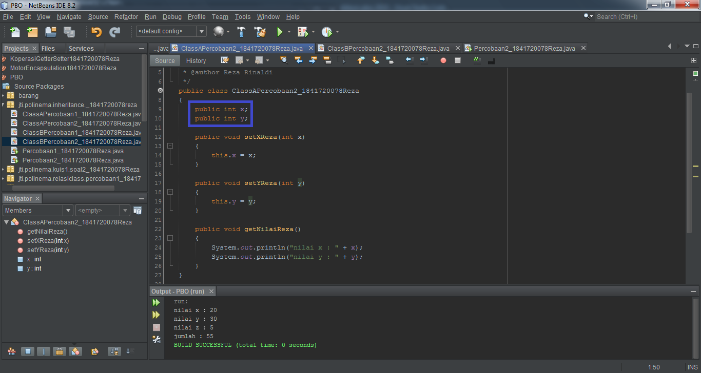
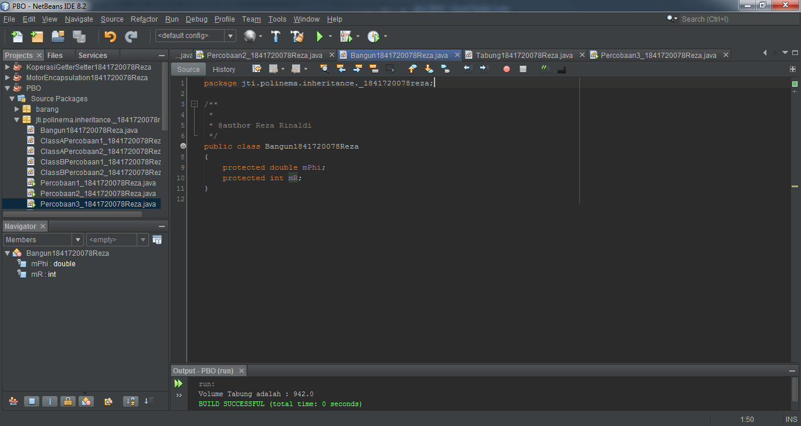
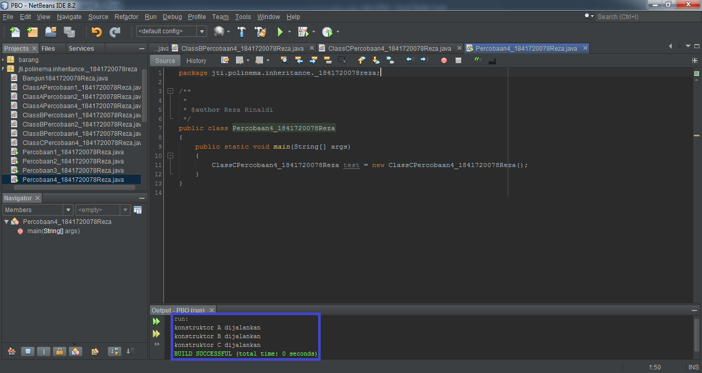

# Laporan Praktikum #6 - Inheritance (Pewarisan)

## Kompetensi

1. Memahami konsep dasar inheritance atau pewarisan.
2. Mampu membuat suatu subclass dari suatu superclass tertentu.
3. Mampu mengimplementasikan konsep single dan multilevel inheritance.
4. Mampu membuat objek dari suatu subclass dan melakukan pengaksesan terhadap atribut dan method baik yang dimiliki sendiri atau turunan dari super class-nya.

## Ringkasan Materi

> **Inheritance** atau **pewarisan sifat** merupakan suatu cara untuk menurunkan suatu class yang lebih umum menjadi suatu class yang lebih spesifik. Inheritance adalah salah satu ciri utama suatu bahasa program yang berorientasi pada objek. Inti dari pewarisan adalah sifat reusable dari konsep object oriented. Setiap **subclass** akan “mewarisi” sifat dari **superclass** selama bersifat protected ataupun public.

> Dalam inheritance terdapat dua istilah yang sering digunakan. Kelas yang menurunkan disebut kelas dasar (**base class/super class**), sedangkan kelas yang diturunkan disebut kelas turunan (**derived class/sub class/child class**) . Di dalam Java untuk mendeklarasikan suatu class sebagai subclass dilakukan dengan cara menambahkan kata kunci **extends** setelah deklarasi nama class, kemudian diikuti dengan nama parent class-nya. Kata kunci extends tersebut memberitahu kompiler Java bahwa kita ingin melakukan perluasan class. Berikut adalah contoh deklarasi inheritance. 

```java
public class B extends A {
     ...
}
```

> Contoh diatas memberikan kompiler Java bahwa kita ingin meng-extend class A ke class B. Dengan kata lain, class B adalah subclass (class turunan) dari class A, sedangkan class A adalah parent class dari class B.


## Percobaan

### Percobaan 1 (extends)

Didalam percobaan ini, kita akan membuat class A, B, dan Percobaan 1 (sebagai class Main-nya) dengan menggunakan metode extends.

Kode Programnya adalah sebagai berikut :

ClassA


ClassB


Percobaan1


*Pada gambar program diatas, percobaan 1 yang dilakukan masih error (bermasalah), maka akan diperbaiki pada bagian pertanyaan-nya.*

## Pertanyaan - Percobaan 1

1. Pada percobaan 1	diatas program yang	dijalankan terjadi error, kemudian perbaiki sehingga program	tersebut bisa dijalankan dan tidak error!

**Jawab:**

Menambahkan "extends" class ClassA di class ClassB, pada baris ke-7 seperti gambar dibawah ini:


Link kode program : 

[ClassAPercobaan1_1841720078Reza](../../src/6_Inheritance/ClassAPercobaan1_1841720078Reza.java)

[ClassBPercobaan1_1841720078Reza](../../src/6_Inheritance/ClassBPercobaan1_1841720078Reza.java)

[Percobaan1_1841720078Reza](../../src/6_Inheritance/Percobaan1_1841720078Reza.java)

2. Jelaskan apa penyebab	program pada percobaan 1 ketika dijalankan terdapat error!

**Jawab:**

Karena ClassB ***belum mengenal atribut x & y***. Maka dari itu diperlukannya ***extends***, ***agar ClassB bisa mengenal atribut dari ClassA***, yakni atribut x & y.

### Percobaan 2 (Hak Akses)

Didalam percobaan ini, kita akan membuat class A, B, dan Percobaan 2 (sebagai class Main-nya) dengan menggunakan hak akses.

Kode Programnya adalah sebagai berikut :

ClassA


ClassB


Percobaan2


*Pada gambar program diatas, percobaan 2 yang dilakukan masih error (bermasalah), maka akan diperbaiki pada bagian pertanyaan-nya.*

## Pertanyaan - Percobaan 2

1. Pada percobaan 2	diatas program yang	dijalankan terjadi error, kemudian perbaiki sehingga program	tersebut bisa dijalankan dan tidak error!

**Jawab:**

Perlu ***mengganti access modifier private pada atribut ke public*** di baris ke-9 & 10 seperti gambar dibawah ini:


Lalu menambahkan ***"extends" class ClassA di class ClassB***, pada baris ke-7. Setelah itu mengganti access modifier private pada atribut ke public di baris ke-9 seperti gambar dibawah ini:


Link kode program : 

[ClassAPercobaan2_1841720078Reza](../../src/6_Inheritance/ClassAPercobaan2_1841720078Reza.java)

[ClassBPercobaan2_1841720078Reza](../../src/6_Inheritance/ClassBPercobaan2_1841720078Reza.java)

[Percobaan2_1841720078Reza](../../src/6_Inheritance/Percobaan2_1841720078Reza.java)

2. Jelaskan apa penyebab	program pada percobaan 2 ketika dijalankan terdapat error!

**Jawab:**

Karena int x, y, dan z mempunyai access modifier yang private, berarti hanya bisa dipakai pada kelas masing-masing & tidak bisa diakses oleh kelas lain.

### Percobaan 3 (Super)

Didalam percobaan ini, kita akan membuat class Bangun, Tabung, dan Percobaan 3 (sebagai class Main-nya) dengan menggunakan metode super.

Kode Programnya adalah sebagai berikut :

Bangun


Tabung


Percobaan3


Link kode program : 

[Bangun1841720078Reza](../../src/6_Inheritance/ClassA1841720078Reza.java)

[Tabung1841720078Reza](../../src/6_Inheritance/ClassB1841720078Reza.java)

[Percobaan3_1841720078Reza](../../src/6_Inheritance/Percobaan3_1841720078Reza.java)

## Pertanyaan - Percobaan 3

1. Jelaskan fungsi “super” pada potongan program berikut di class Tabung!
> ```java
> public void setSuperPhi(double phi) {
> super.phi = phi;
> }
> public void setSuperR(int r) {
> super.r = r;
> }
> ```

**Jawab:**

Untuk mengambil nilai phi dan r dari class parent, yakni class Bangun.

2. Jelaskan fungsi “super” dan “this” pada potongan program berikut di class Tabung!
>```java
> public void volume() {
> System.out.println("Volume Tabung adalah: " + super.phi*super.r*super.r*this.t));
> }

**Jawab:**

**"super"** untuk mengambil nilai phi dan r dari class parent, sedangkan **"this"** untuk mengambil nilai t dari kelas child.

3. Jelaskan mengapa pada class Tabung tidak dideklarasikan atribut “phi” dan “r” tetapi class tersebut dapat mengakses atribut tersebut!

**Jawab:**

Karena kelas Tabung adalah subclass (child) dari class Bangun.

### Percobaan 4 (super constructor)

Didalam percobaan ini, kita akan membuat class A, B, C dan Percobaan 4 (sebagai class Main-nya) dengan menggunakan metode super constructor.

Kode Programnya adalah sebagai berikut :

ClassA


ClassB


ClassC


Percobaan4


Link kode program : 

[ClassA1841720078Reza](../../src/6_Inheritance/ClassA1841720078Reza.java)

[ClassB1841720078Reza](../../src/6_Inheritance/ClassB1841720078Reza.java)

[ClassC1841720078Reza](../../src/6_Inheritance/ClassC1841720078Reza.java)

[Percobaan4_1841720078Reza](../../src/6_Inheritance/Percobaan4_1841720078Reza.java)

## Pertanyaan - Percobaan 4

1. Pada percobaan 4	sebutkan mana class yang termasuk superclass dan subclass, kemudian jelaskan alasannya!

**Jawab:**

- Super Class : classA adalah parent dari classB, sedangkan classB adalah parent dari classC.
- Subclass    : classB adalah child dari classA, sedangkan classC adalah child dari classB

*Karena pada classB dan classC kita mengetikkan extends pada programnya, untuk memanggil nilai dari induk class. Kelas classB memanggil induknya yakni classA agar mendapatkan nilainya. Begitu juga kelass classC memanggil induknya yakni kelas classB.*

2. Ubahlah isi konstruktor default ClassC seperti berikut:
>```java
> public class ClassC extends ClassB {
>    ClassC() {
>    super();
>    System.out.println("konstruktor C dijalankan");
>     }
> }

Tambahkan	kata	super() di baris pertama dalam konstruktor defaultnya. Coba jalankan kembali class Percobaan4 dan	terlihat tidak ada perbedaan dari hasil outputnya!

**Jawab:**

Program yang telah ditambahkan kata super(); pada class ClassC:

Hasilnya tidak ada perubahan, sama seperti dengan hasil sebelumnya.

3. Ubahlah isi konstruktor default ClassC seperti berikut:
>```java
> public class ClassC extends ClassB {
>    ClassC() {
>    System.out.println("konstruktor C dijalankan");
>    super();
>    }
> }

Ketika mengubah posisi super() dibaris kedua dalam konstruktor defaultnya dan terlihat ada error. 


Kemudian kembalikan super() kebaris pertama seperti sebelumnya, maka errornya akan hilang.

Perhatikan hasil keluaran ketika class Percobaan4 dijalankan. Kenapa bisa tampil output seperti berikut pada saat instansiasi objek test dari class ClassC


Jelaskan bagaimana urutan proses jalannya konstruktor saat objek test dibuat!

**Jawab:**

Dimulai dari konstruktor ClassA lalu menjalankan konstruktor ClassB yang memiliki pewarisan dari ClassA dan ClassC menjalankan konstruktor ClassC yang memiliki pewarisan dari ClassB.

4. Apakah	fungsi super()	pada	potongan program dibawah ini di ClassC!
>```java
> public class ClassC extends Class B {
>    ClassC() {
>    super();
>    System.out.println("konstruktor C dijalankan")
>    }
> }  

**Jawab:**

Mengeksekusi konstruktor parent (kelas induk).

### Percobaan 5 

Didalam percobaan ini, kita akan membuat Karyawan, Staff, Manager dan Inheritance 1 (sebagai class Main-nya).

Kode Programnya adalah sebagai berikut :

Karyawan


Manager


Staff


Inheritance1


Link kode program : 

[Karyawan1841720078Reza](../../src/6_Inheritance/Karyawan1841720078Reza.java)

[Manager1841720078Reza](../../src/6_Inheritance/Manager1841720078Reza.java)

[Staff1841720078Reza](../../src/6_Inheritance/Staff1841720078Reza.java)

[Inheritance1_1841720078Reza](../../src/6_Inheritance/Inheritance1_1841720078Reza.java)

## Pertanyaan - Percobaan 5

1. Sebutkan class mana yang termasuk super class dan sub class dari percobaan 5 diatas!

**Jawab:**

Super classnya adalah Karyawan, dan subclassnya adalah Staff dan Manager

2. Kata kunci apakah yang digunakan untuk menurunkan suatu class ke class yang lain?

**Jawab:**

**extends**

3. Perhatikan kode program pada class Manager, atribut apa saja yang dimiliki oleh class tersebut? Sebutkan atribut mana saja yang diwarisi dari class Karyawan!

**Jawab:**

Yang merupakan attribute class Manager adalah tunjangan. Sedangkan atribut turunan dari karyawan adalah nama, alamat, umur, dan gaji.

4. Jelaskan kata kunci super pada potongan program dibawah ini yang terdapat pada class Manager!
>```java
> System.out.println("Total Gaji = " + (super.gaji + tunjangan));
>```

**Jawab:**

Menampilkan total gaji yang berasal dari hasil tambah gaji dari class Karyawan yang merupakan superclass dan tunjangan dari class Manager yang merupakan subclass.

5. Program pada percobaan 5 diatas termasuk dalam jenis inheritance apa? Jelaskan alasannya!

**Jawab:**

Jenisnya Single Inheritance, karena subclass Staff dan Manager hanya memiliki satu parent class yaitu Karyawan.

### Percobaan 6

Berdasarkan program yang sudah anda buat pada percobaan 5 sebelumnya tambahkan dua class yaitu class StaffTetap dan class StaffHarian.

Kode Programnya adalah sebagai berikut:

StaffTetap


StaffHarian


Setelah membuat dua class diatas kemudian edit class Inheritance1.java menjadi sebagai berikut:


Link kode program : 

[StaffTetap1841720078Reza](../../src/6_Inheritance/StaffTetap1841720078Reza.java)

[StaffHarian1841720078Reza](../../src/6_Inheritance/StaffHarian1841720078Reza.java)

[Inheritance1_1841720078Reza](../../src/6_Inheritance/Inheritance1_1841720078Reza.java)

## Pertanyaan - Percobaan 6

1. Berdasarkan class diatas manakah yang termasuk single inheritance dan mana yang termasuk multilevel inheritance?

**Jawab:**

- Simple level: Class Manager terhadap class Karyawan
- Multi level: Class StaffTetap dan StaffHarian terhadap class Staff, lalu dilanjutkan 
dengan Staff terhadap Karyawan.

2. Perhatikan kode program class StaffTetap dan StaffHarian, atribut apa saja yang dimiliki oleh class tersebut? Sebutkan atribut mana saja yang diwarisi dari class Staff!

**Jawab:**

- StaffTetap: gaji, lembur, potongan, asuransi.
- StaffHarian: gaji, lembur, potongan.

3. Apakah fungsi potongan program berikut pada class StaffHarian
>```java
> super(nama, alamat, jk, umur, gaji, lembur, potongan);
>```

**Jawab:**

Memanggil atribut dari parent nya, yaitu nama, alamat, jk, umur, gaji, lembur, dan potongan.

4. Apakah fungsi potongan program berikut pada class StaffHarian
>```java
> super.tampilDataStaff();
>```

**Jawab:**

Menjalankan method tampilDataStaff yang ada di parent yaitu class Staff.

5. Perhatikan kode program dibawah ini yang terdapat pada class StaffTetap
>```java
> System.out.println("Gaji Bersih = " + (gaji + lembur - potongan - asuransi));
>```
Terlihat dipotongan program diatas atribut gaji, lembur dan potongan dapat diakses langsung. Kenapa hal ini bisa terjadi dan bagaimana class StaffTetap memiliki atribut gaji, lembur, dan potongan padahal dalam class tersebut tidak dideklarasikan atribut gaji, lembur, dan potongan?

**Jawab:**

Karena subclass StaffHarian maupun StaffTetap diwariskan sifat dari parent classnya yaitu Staff dan Karyawan.

## Tugas

Buatlah sebuah	program dengan	konsep pewarisan seperti	pada class diagram berikut ini. Kemudian buatlah instansiasi	objek untuk menampilkan data pada class Mac, Windows dan Pc!.

Kode Programnya adalah sebagai berikut :

Komputer


Leptop


Pc


Mac


Windows


MainTugas


Link kode program:

[Komputer1841720078Reza](../../src/6_Inheritance/Komputer1841720078Reza.java)

[Leptop1841720078Reza](../../src/6_Inheritance/Leptop1841720078Reza.java)

[Pc1841720078Reza](../../src/6_Inheritance/Pc1841720078Reza.java)

[Mac1841720078Reza](../../src/6_Inheritance/Mac1841720078Reza.java)

[Windows1841720078Reza](../../src/6_Inheritance/Windows1841720078Reza.java)

[MainTugas1841720078Reza](../../src/6_Inheritance/MainTugas1841720078Reza.java)

*NB: Pada atribut **kecProsesor** saya ganti dari **variable int ke double**, dikarenakan **hasil angka dari atribut kecProsesor ada ","** maka dari itu saya menggunakan variable **double**.*

## Kesimpulan

> Pada jobsheet ke-6 ini, kita diajarkan lebih mendalam bagaimana mengimplementasikan program yang didalamnya ada proses penurunan / pewarisan kelas (Inheritance).

> Ada juga konsep dari inheritance diantaranya, **Single Inheritance** & **Multilevel Inheritance**.

>* Konsep ***single inheritance*** hanya memperbolehkan
suatu sublass mempunyai **satu parent class**.
>* Konsep ***multilevel inheritance*** memperbolehkan suatu
subclass mempunyai subclass lagi **(lebih dari satu subclass)**.

## Pernyataan Diri

Saya menyatakan isi tugas, kode program, dan laporan praktikum ini dibuat oleh saya sendiri. Saya tidak melakukan plagiasi, kecurangan, menyalin/menggandakan milik orang lain.

Jika saya melakukan plagiasi, kecurangan, atau melanggar hak kekayaan intelektual, saya siap untuk mendapat sanksi atau hukuman sesuai peraturan perundang-undangan yang berlaku.

Ttd,

***(Reza Rinaldi)***
