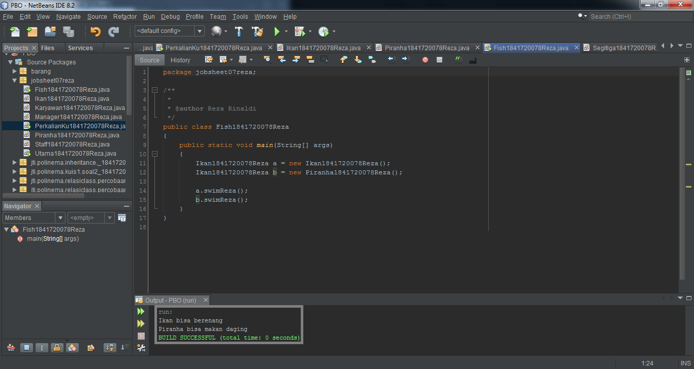

# Laporan Praktikum #7 - Overloading dan Overriding

## Kompetensi

1. Memahami konsep overloading dan overriding,
2. Memahami perbedaan overloading dan overriding,
3. Ketepatan dalam mengidentifikasi method overriding dan overloading
4. Ketepatan dalam mempraktekkan instruksi pada jobsheet
5. Mengimplementasikan method overloading dan overriding.

## Ringkasan Materi

> **Overloading** Overloading adalah suatu keadaan dimana terdapat method dengan nama yang sama, tetapi memiliki signature yang berbeda.

> *signature adalah susunan parameter pada deklarasi 
method.* Overloading dapat terjadi didalam satu class ataupun 
pada parent class dan sub class.

> Ciri-ciri overloading:
>* Nama method harus sama.
>* Daftar parameter (signature) harus berbeda.
>* Return type boleh sama, juga boleh berbeda

> *Konstruktor pun dapat di-overloading.*

> Kapan Menggunakan Overloading? Al Jawab: **Untuk menyederhanakan kode program dan
konsistensi dalam hal penamaan method.**
*Karena terkadang kita perlu membuat beberapa method 
yang kegunaannya sama, namun parameternya berbeda.*

> **Overriding** terjadi jika terdapat method pada subclass dengan **nama yang sama dan signature yang sama** dengan **parent-class** nya.

> Ciri-ciri overriding:
>* Terjadi pada sub class/class turunan
>* Nama method sama.
>* Signature (susunan parameter) sama.
>* Return type sama.

> Kapan Menggunakan Overriding? Al Jawab: **Overriding digunakan saat terdapat sebuah class 
yang merupakan turunan dari class lain, namun ingin
mengubah fungsionalitas dari method yang 
diwariskan, tanpa harus menambah method baru.**

## Percobaan
## Percobaan 1

Untuk kasus contoh berikut ini, terdapat tiga kelas, yaitu Karyawan, Manager, dan Staff. Class Karyawan merupakan superclass dari Manager dan Staff dimana subclass Manager dan Staff memiliki method untuk menghitung gaji yang berbeda.

Hasilnya adalah sebagai berikut:

> Karyawan
> 

> Staff
> 

> Manager
> 

> Utama
> 
> 

Link kode program:

[Karyawan1841720078Reza](../../src/7_Overriding_dan_Overloading/Karyawan1841720078Reza.java)

[Staff1841720078Reza](../../src/7_Overriding_dan_Overloading/Staff1841720078Reza.java)

[Manager1841720078Reza](../../src/7_Overriding_dan_Overloading/Manager1841720078Reza.java)

[Utama1841720078Reza](../../src/7_Overriding_dan_Overloading/Utama1841720078Reza.java)

## Latihan
## Latihan 1

Latihan pertama akan membuat sebuah perhitungan matematika perkalian. Kitak akan membuat class PerklianKu terlebih dahulu.

Hasilnya adalah sebagai berikut:

> 

### Pertanyaan - Latihan 1

1. Dari source coding diatas terletak dimanakah overloading?

**Jawab:**

Pada baris ke 9 & 14
> 

2. Jika terdapat overloading ada berapa jumlah parameter yang berbeda?

**Jawab:**

Jumlah awalnya ada 2 pada baris ke-9, lalu dioverload 3 buah pada baris ke-14.

## Latihan 2

Kemudian pada class PerkalianKu, perhitungan yang ke-dua akan diganti dari tipe data integer ke *tipe data double*.

Hasilnya adalah sebagai berikut:

> 

### Pertanyaan - Latihan 2

1. Dari source coding diatas terletak dimanakah overloading?

**Jawab:**

Pada baris ke-9 & 21
> 

2. Jika terdapat overloading ada berapa tipe parameter yang berbeda?

**Jawab:**

Ada 2 buah, perbedaanya hanya pada tipe data yang digunakan.

Link kode program :

[PerkalianKu1841720078Reza](../../src/7_Overriding_dan_Overloading/PerkalianKu1841720078Reza.java)

## Latihan 3

Pada latihan ke-3 kita akan membuat program menggunakan teknik dynamic method dispatch.

Hasilnya adalah sebagai berikut:

> Ikan
> 

> Piranha
> 

> Fish
> 

Link kode program : 

[Ikan1841720078Reza](../../src/7_Overriding_dan_Overloading/Ikan1841720078Reza.java)

[Piranha1841720078Reza](../../src/7_Overriding_dan_Overloading/Piranha1841720078Reza.java)

[Fish1841720078Reza](../../src/7_Overriding_dan_Overloading/Fish1841720078Reza.java)

### Pertanyaan - Latihan 3

1. Dari source coding diatas terletak dimanakah overriding?

**Jawab:**

> 

2. Jabarkanlah apabila sourcoding diatas jika terdapat overriding?

**Jawab:**

> Pada class Ikan terdapat sebuah method dengan nama swim() dan tidak memiliki parameter, lalu dibuat sebuah class lain yang meng-extend class Ikan dengan nama class Piranha, pada class tersebut terdapat juga sebuah method bernama swim() dan juga tidak memiliki parameter, maka pada saat pemanggilan method swim() dari class Piranha pada class Fish, method swim() akan meng-override method swim() yang ada pada method class Ikan dengan mengetik object "Ikan b = new Piranha();" lalu dipanggil "b.swim();" sehingga akan memunculkan keluaran "Piranha bisa makan daging".

## Tugas

1. Implementasikan konsep overloading pada class diagram dibawah ini :

> 

Hasil outputnya:

> 

Link kode program : 

[Segitiga1841720078Reza](../../src/7_Overriding_dan_Overloading/Segitiga1841720078Reza.java)

2. Implementasikan class diagram dibawah ini dengan menggunakan teknik dynamic method dispatch :

> 

Hasil outputnya:

> Manusia
> 

> Dosen
> 

> Mahasiswa
> 

> MainManusia
> 

Link kode program : 

[Manusia1841720078Reza](../../src/7_Overriding_dan_Overloading/Manusia1841720078Reza.java)

[Dosen1841720078Reza](../../src/7_Overriding_dan_Overloading/Dosen1841720078Reza.java)

[Mahasiswa1841720078Reza](../../src/7_Overriding_dan_Overloading/Mahasiswa1841720078Reza.java)

[MainManusia1841720078Reza](../../src/7_Overriding_dan_Overloading/MainManusia1841720078Reza.java)

## Kesimpulan

> Pada jobsheet ke-7 ini kita diperkenalkan :
>- Overriding dan overloading, metode ini juga termasuk dalam konsep OOP Polymorphism,
>- Pengimplementasian override dan overload sehingga fungsi bisa digunakan berulang dan menghemat memori program dalam mengingat nama sebuah fungsi,
>- dan **Metode dynamic dispatch**, yang dimana class parent dapat menggunakan method dan atribut dari anaknya (class child).

## Pernyataan Diri

Saya menyatakan isi tugas, kode program, dan laporan praktikum ini dibuat oleh saya sendiri. Saya tidak melakukan plagiasi, kecurangan, menyalin/menggandakan milik orang lain.

Jika saya melakukan plagiasi, kecurangan, atau melanggar hak kekayaan intelektual, saya siap untuk mendapat sanksi atau hukuman sesuai peraturan perundang-undangan yang berlaku.

Ttd,

***(Reza Rinaldi)***
