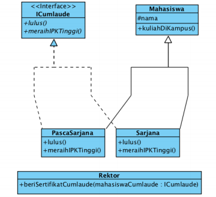

# Laporan Praktikum #9 - Abstract Class dan Interface

## Kompetensi

1. Menjelaskan maksud dan tujuan penggunaan Abstract Class;
2. Menjelaskan maksud dan tujuan penggunaan Interface;
3. dan Menerapkan Abstract Class dan Interface di dalam pembuatan program.

## Ringkasan Materi

> *Abstract Class* adalah class yang tidak dapat diinstansiasi namun dapat di-extend. Abstract class baru
dapat dimanfaatkan ketika ia di-extend.

> **Karakteristik** :
>* Dapat memiliki properties dan methods seperti class biasa.
>* Selalu memiliki methods yang tidak memiliki tubuh (hanya deklarasinya saja), disebut juga 
abstract method.
>* Selalu dideklarasikan dengan menggunakan kata kunci abstract class.

**Kegunaan**, menggambarkan sesuatu yang bersifat umum, yang hanya bisa berfungsi setelah ia dideskripsikan ke
dalam bentuk yang lebih spesifik.

> *Interface* adalah struktur data yang hanya berisi abstract methods. Tidak ada apa-apa selain method 
abstract pada interface, termasuk atribut getter dan setter.

> **Karakteristik** :
>* Tidak ada apa-apa di dalamnya selain abstract methods.
>* Di konvensi bahasa pemrograman Java, namanya dianjurkan untuk selalu diawali dengan huruf 
kapital ‘I’.
>* Selalu dideklarasikan dengan menggunakan kata kunci interface.
>* Diimplementasikan dengan menggunakan kata kunci implements.

**Kegunaan**, bertindak seperti semacam kontrak/syarat yang HARUS dipenuhi bagi suatu class agar class tersebut dapat dianggap sebagai ‘sesuatu yang lain’.

## Percobaan
## Percobaan 1: Abstract Class

Di dunia ini terdapat banyak jenis hewan. Semua hewan memiliki beberapa karakteristik yang sama, seperti contohnya semua hewan memiliki umur, hewan apapun itu, umurnya akan bertambah sama jumlahnya setiap tahun.

Selain karakteristik yang sama, masing-masing hewan juga memiliki karakteristik yang berbeda satu dengan yang lainnya. Contohnya dalam hal bergerak. Cara kucing bergerak berbeda dengan cara ikan bergerak. Kucing bergerak dengan cara melangkahkan kaki-kakinya sedangkan ikan bergerak dengan cara menggerakkan siripnya.

> 

Setiap orang yang memelihara hewan dapat mengajak hewan peliharaannya berjalan (membuat agar hewan peliharaannya bergerak). Namun orang yang memelihara hewan yang berbeda, akan berbeda pula cara hewan peliharaannya dalam bergerak.

Pada percobaan pertama ini kita akan membuat sebuah program yang menggambarkan skenario di atas dengan memanfaatkan abstract class.

Hasilnya adalah sebagai berikut:

> Hewan
> 

> Kucing
> 

> Ikan
> 

> Orang
> 

> Program
> 

Link kode program :

[Hewan1841720078Reza](../../src/9_Abstract_Class_dan_Interface/Hewan1841720078Reza.java)

[Kucing1841720078Reza](../../src/9_Abstract_Class_dan_Interface/Kucing1841720078Reza.java)

[Ikan1841720078Reza](../../src/9_Abstract_Class_dan_Interface/Ikan1841720078Reza.java)

[Orang1841720078Reza](../../src/9_Abstract_Class_dan_Interface/Orang1841720078Reza.java)

[Program1_1841720078Reza](../../src/9_Abstract_Class_dan_Interface/Program1_1841720078Reza.java)

### Pertanyaan - Percobaan 1
Bolehkah apabila sebuah class yang meng-extend suatu abstract class tidak mengimplementasikan method abstract yang ada di class induknya? Buktikan!

**Jawab:**

Tidak boleh.

> 

## Percobaan 2: Interface

Pada sebuah wisuda, seorang Rektor akan memberikan penghargaan sertifikat Cumlaude pada semua mahasiswa yang memenuhi persyaratan. Persyaratan agar seorang mahasiswa dapat disebut sebagai Cumlaude berbeda-beda antara mahasiswa Sarjana dan Pasca Sarjana.

> 

Untuk menjadi cumlaude, mahasiswa Sarjana harus mengerjakan skripsi dan memiliki IPK lebih tinggi dari 3,51. Sedangkan untuk mahasiswa Pasca Sarjana, mereka harus mengerjakan tesis dan meraih IPK lebih tinggi dari 3,71.

Hasilnya adalah sebagai berikut:

> ICumlaude
> 

> Mahasiswa
> 

> Sarjana
> 

> PascaSarjana
> 

> Rektor
> 

> Program
> 

Link kode program :

[ICumlaude1841720078Reza](../../src/9_Abstract_Class_dan_Interface/ICumlaude1841720078Reza.java)

[Mahasiswa1841720078Reza](../../src/9_Abstract_Class_dan_Interface/Mahasiswa1841720078Reza.java)

[Sarjana1841720078Reza](../../src/9_Abstract_Class_dan_Interface/Sarjana1841720078Reza.java)

[PascaSarjana1841720078Reza](../../src/9_Abstract_Class_dan_Interface/PascaSarjana1841720078Reza.java)

[Rektor1841720078Reza](../../src/9_Abstract_Class_dan_Interface/Rektor1841720078Reza.java)

[Program23_1841720078Reza](../../src/9_Abstract_Class_dan_Interface/Program23_1841720078Reza.java)

### Pertanyaan - Percobaan 2

1. Mengapa pada langkah nomor 9 terjadi error? Jelaskan!

**Jawab:**

Karena pada class **Mahasiswa tidak meng-implement interface ICumlaude** seperti class Sarjana & PascaSarjana. Sehingga yang terindentifikasi pada method class Rektor hanya class Sarjana & PascaSarjana yang telah meng-implements interface ICumlaude.

2. Dapatkah method kuliahDiKampus() dipanggil dari objek sarjanaCumlaude di classProgram? Mengapa demikian?

**Jawab:**

Dapat, karena class Sarjana telah meng-extend class Mahasiswa, sehingga objek sarjanaCumlaude dapat memanggil method kuliahDiKampus() yang ada pada class Mahasiswa.

3. Dapatkah method kuliahDiKampus() dipanggil dari parameter mahasiswa di method beriSertifikatCumlaude() pada class Rektor? Mengapa demikian?

**Jawab:**

Tidak dapat, karena method kuliahDikampus() belum ditambahkan dalam interface ICumlaude menjadi method abstract.

4. Modifikasilah method beriSertifikatCumlaude() pada class Rektor agar hasil eksekusi class Program menjadi seperti berikut ini:

> 

**Jawab:**

Menambahkan method abstract kuliahDiKampus() pada interface ICumlaude:

> 

Memanggil method abstract kuliahDiKampus() pada class Rektor:

> 

## Percobaan 3: Multiple Interfaces Implementation

Pada percobaan kali ini kita akan memodifikasi program yang telah dibuat pada Percobaan 2 sehingga pada program tersebut nantinya akan terdapat sebuah class yang meng-implements lebih dari 1 interface.

> 

Bayangkan pada skenario sebelumnya, dimana seorang rektor juga akan mem-beriSertifikatMawapres() pada sebuah acara wisuda. Mahasiswa yang berhak menerima 
penghargaan tersebut tentunya adalah mahasiswa yang berprestasi, dimana kriteria prestasi di sini berbeda antara mahasiswa Sarjana dengan mahasiswa Pasca Sarjana. Pada percobaan ini, kita akan menentukan kriteria prestasi yaitu: harus menjuaraiKompetisi() dan membuatPublikasiIlmiah().

Hasilnya adalah sebagai berikut:

> IBerprestasi
> 

> PascaSarjana
> 

> Rektor
> 

> Program
> 

Link kode program :

[IBerprestasi1841720078Reza](../../src/9_Abstract_Class_dan_Interface/IBerprestasi1841720078Reza.java)

[PascaSarjana1841720078Reza](../../src/9_Abstract_Class_dan_Interface/PascaSarjana1841720078Reza.java)

[Rektor1841720078Reza](../../src/9_Abstract_Class_dan_Interface/Rektor1841720078Reza.java)

[Program23_1841720078Reza](../../src/9_Abstract_Class_dan_Interface/Program23_1841720078Reza.java)

### Pertanyaan - Percobaan 3

Apabila Sarjana Berprestasi harus menjuarai kompetisi NASIONAL dan menerbitkan artikel di jurnal NASIONAL, maka modifikasilah class-class yang terkait pada aplikasi Anda agar di class Program objek pakRektor dapat memberikan sertifikat mawapres pada objek sarjanaCumlaude.

> 

**Jawab:**

Menambahkan kode program pada class Sarjana, seperti class PascaSarjana pada percobaan 3.

Hasilnya sebagai berikut:

> Sarjana
> 

Sehingga pada class Program akan normal (tidak ada yang error).
> Program
> 

## Kesimpulan

> Dalam pratikum ke-9 ini kita dapat :
>* Mengerti maksud dan tujuan penggunaan Abstract Class,
>* Mengerti maksud dan tujuan penggunaan Interface maupun Interface yang multivalue,
>* dan menerapkan Abstract Class dan Interface dalam pembuatan program.

## Pernyataan Diri

Saya menyatakan isi tugas, kode program, dan laporan praktikum ini dibuat oleh saya sendiri. Saya tidak melakukan plagiasi, kecurangan, menyalin/menggandakan milik orang lain.

Jika saya melakukan plagiasi, kecurangan, atau melanggar hak kekayaan intelektual, saya siap untuk mendapat sanksi atau hukuman sesuai peraturan perundang-undangan yang berlaku.

Ttd,

***(Reza Rinaldi)***
